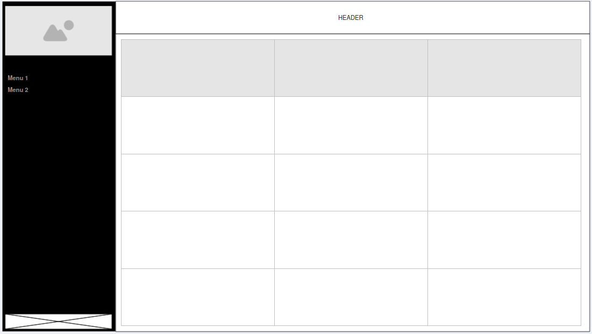
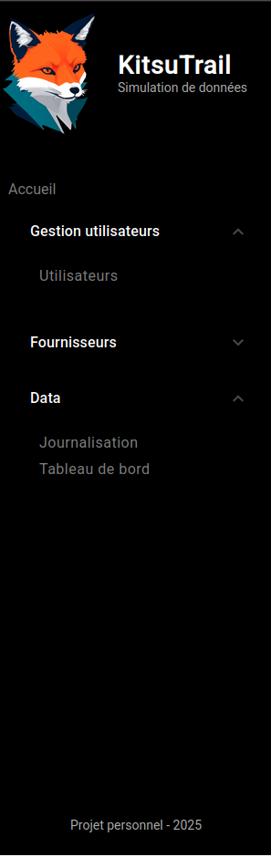

# Journal de bord

Fichier de suivis et notes informatives tout au long du développement du projet.

Le projet à pour objectif d'insérer des éléments de tableaux de bords dans une application Web existante ou pseudo existante.
La plateforme cible utilise Angular et est déployée dans une infrastructure Cloud.

Avant le début du projet j'ai commencé à apprendre Angular sur les sites suivants:
- https://angular.dev/
- https://openclassrooms.com

L'idée principale est de développer une application Angular qui va permettre à un utilisateur d'ajouter des lignes de log d'audit pour simuler des actions utilisateurs sur une plateforme de gestion des accès.

Une fois cette plateforme en place, il sera alors possible de travailler sur l'ajout des tableaux de bord et rapport qui vont se baser sur les logs renseigner par les utilisateurs.

Initialement, je compte utiliser les technologies suivantes:
- Frontend: Angular (nécessité technique)
- Backend: Python (Affinité avec le langage et approfondissement des mes connaissances)
  * Facilité d'intégration de modèle IA
  * FastAPI: (apprentissage de la mise en place d'un serveur API)
- Base de données: (Choix final à définir)
  * Postgres SQL: base de données puissante et connue
  * MongoDB: base noSQL flexible et facilement transférable dans le cloud (Cloud Atlas)
- Docker: (Utiliser pour le développement) 

## 2025-03-23 - Initialisation du projet
Démarrage officiel du projet avec la création des répertoires de l'architecture globale du projet avec les répertoires frontend, backend et database.
J'ai également ajouté ce fichier journal de bord, des fichiers README et une licence MIT pour être complètement OpenSource.

L'ensemble du projet a été poussé dans github: [https://github.com/peredur0/KitsuTrail](https://github.com/peredur0/KitsuTrail)

Le nom du projet est KitsuTrail, Kitsu en référence au renard et Trail pour la piste. Je tente également de créer le logo de la plateforme avec de l'IA générative.
J'utilise le modèle Dreamshaper8 avec une instance local InvokeAI, pour générer un logo.

**Démarrage du développement du frontend**
- Utilisation de node 18 `nvm use 18`
- Utilisation d'Angular 19 `npm i -g @angular/cli`
- Création de l'application angular (sans tests pour le moment) `ng new KitsuTrail --style=scss` (Sans SSR)
- Draft du design à l'aide de Moqups [https://app.moqups.com](https://app.moqups.com) 

**Mise en place de l'architecture et des premiers composant**
- core: répertoire pour les modules de base de l'application
  - components
    - header: entête du site
    - landing-page: page d'accueil
    - sidebar: barre de navigation latérale
- features: répertoire des fonctionnalités de l'app
  - users: composant spécialisé dans la gestion des utilisateurs
    - components
      - users-list: liste des utilisateurs

L'ajout du composant user-list va simplement permettre de vérifier la bonne configuration du routing dans cette phase.
Je garde aussi cette page comme exemple de lazy-loading pour plus tard.
Les guards ne sont pas en place pour le moment.

**Mise en forme globale**
Préparation CSS des 3 éléments principaux de l'affichage.
1. Barre latérale
  * Mise en forme du header avec l’icône, un titre et un sous-titre
  * Préparation liens et des menus déroulants
  * Mise en place d'un pied de page qui va contenir le nom de l'utilisateur
2. Entête
  * Elle va servir à transmettre des informations à l'utilisateur
3. Contenant principal
  * c'est la que les actions de l'utilisateur vont se dérouler.

Le favicon a également été changé.

Le logo et le favicon ont été généré par IA (voir plus haut), des modifications mineures, principalement de la transparence, ont été réalisées avec GIMP.

> Fin de travail:
> Prochaine étape gérer les menus déroulants de la barre latérale


## 2025-04-24 - Travail sur la barre latérale
L'idée est d'ajouter des menus retractable dans le sidebar.
Le module Angular Material offre cette possibilité [https://material.angular.io/](https://material.angular.io/)
```
ng add @angular/material
```
Documentation sur les expansion panel : [https://material.angular.io/components/expansion/overview](https://material.angular.io/components/expansion/overview)

La mise en place des menu retractable est assez simple.
Tout comme la modification des éléments graphique.
L'installation du module va ajouter des données dans le fichier style global. Il est alors possible de faire un override dans le CSS du component.

J'ai ajouté des liens fictifs afin de donner un peu de corps à la barre latérale.

> **Difficultés**:
> 1. Je ne suis pas parvenue à gérer correctement l'espacement entre le header du menu retractable et le premier item de la liste en dessous
> 2. Le div central de la sidebar n'est pas scrollable. Sur des fenêtres petites certains menu peuvent se retrouver masqués

Résultat en image:




> Le travail de ce jour a été principalement HTML et CSS et uniquement sur la barre latérale. Demain on vas essayer de construire la page d'accueil ou la gestion des utilisateurs


## 2025-03-25 - Travail sur la page d'accueil et le header
- Renommage du répertoire Angular de KitsuTrail en Shiro (blanc)
- Préparation du nom du backend (Kuro)

Actions sur la page d'accueil:
- Mise en place de boite et des boutons qui vont être utilisée pour permettre de se rendre sur les pages de l'application

## 2025-03-06 Amélioration du code de la page d'accueil
- Mise en place d'un service unique pour gérer l'affichage et la présence des menus dans la sidebar et la landing-page.
> Prochaine étape utiliser ce service dans l'affichage avec des ngFor et ngIf. L'objectif est d'avoir un code le plus modulaire possible

Les menus de la landing page sont maintenant beaucoup plus modulaires.
Les propriétés de chaque menu sont maintenant gérées dans un service.
L'affichage se fait avec une boucle @for dans le template html.
Selon la propriété display du menu je suis capable d'afficher ou non un menu avec l'instruction @if.
J'ai également utiliser l'instruction *ngFor dans une balise article pour s'occuper de l'affichage des boutons.

Je dois maintenant appliquer du CSS sur ces boutons.

L'étape d'après sera de remplacer le code statique dans la sidebar.
