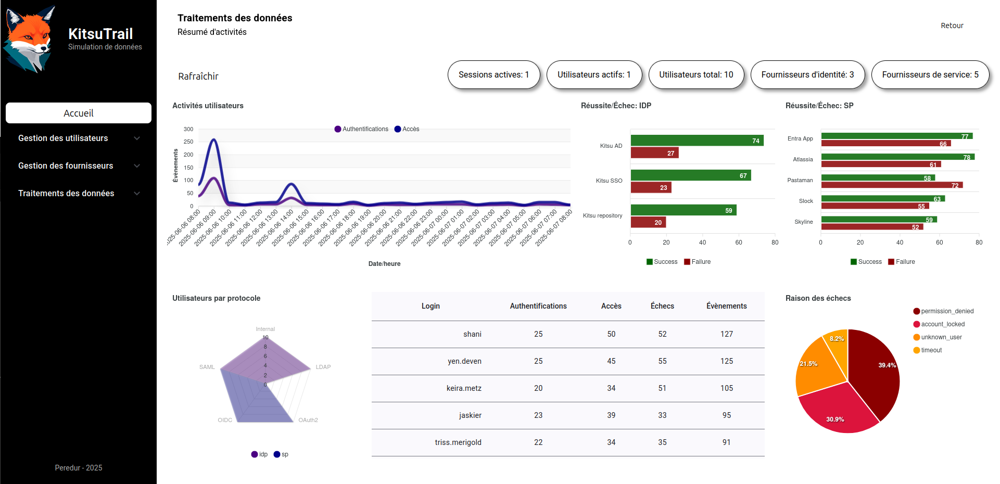

# Journal de bord

Notes lors du développement du tableau de bord.

## 2025-05-28 Démarrage de l'analyse
Une nouvelle branche a été créée pour débuter l'ajout du tableau de bord dans l'application.

Pour l'affichage, je pense utiliser `ng2-charts` qui semble être assez populaire.

Coté base de données, je pense qu'il sera nécessaire de basculer sur une base PSQL.

Pour le backend, il faudra ajouter les endpoint qui vont exposer les métriques.
Niveau performance, je pense qu'il sera préférable d'avoir un backend qui va gérer l'aggregation des métriques

Optionnellement, j'aimerais pouvoir ajouter un autre backend qui va pousser des données en continue dans la base.

Durant cette phase je vois les développement suivants:
1. Migration vers PSQL (docker partiel)
2. Service pour l'aggregation des données
3. Intégration construction du tableau de bord
4. Service pour la génération continue des données de simulation (optionnel)

## 2025-05-28 Migration postgres
Pour le fun, j'ai décidé de renommer la base SQLite Zenko.
La base PSQL prendra le nom d'Inari.

Les plus grandes modifications on été faites sur les scripts permettant d'initialiser les tables avec les données de base.

### SQLite
La base SQLite a été déplacée dans un répertoire nommé Zenko.
Pas ou peu de modification sur ce plan. La base reste en place mais elle n'a techniquement pas vocation à rester.
Elle reste néanmoins accessible pour Kuro (backend)

### PostgreSQL
L'affichage des tableaux de bords avec la génération de données statistiques risque de mettre un peu plus de pression sur la base de données, c'est pour cela que j'ai décidé de passé sur un moteur un peu stable.
J'utilise la version 16.9. Une version 17.0 est sortie récemment mais j'attends de voir si toutes les dépendances sont disponibles notamment chez les clients.

J'utilise un fichier compose.yaml avec docker compose pour démarrer une instance PSQL.
J'avais déjà utilisé cette technologie lors de mon projet précédent. J'ai pu reprendre certain éléments notamment le fichier `init.sql`, qui initialise l'utilisateur *inari* et la base de données.

Les informations de connexions pour table sont stockés dans le fichier `secrets.json`. Les informations doivent correspondre avec le fichier `.env` utilisé pour le docker compose.

### Backend Hatsuho
J'ai du modifier le programme d'initialisation pour qu'il correspondent aux nécessité de PSQL qui ne sont pas totalement identique à celles pour SQLite. J'ai déplacé ce programme dans la partie backend. Il s'appelle maintenant Hatsuho. (Toujours dans le thème des renards mythologiques japonnais)
Si je passe sur un service complémentaire pour générer automatiquement des données, ce programme sera ma base de travail.

### Backend Kuro
Avec SQLite, le backend Kuro (API) allait récupérer directement des informations dans SQLite avec un engine sqlalchemy.
Grace à ce framework, il est possible de modifier assez facilement le type de base de données à interroger.
Techniquement c'est juste un URL à changer.

J'ai ajouté une variable MODE qui permet de changer rapidement entre SQLite et PSQL si besoin.


> Prochaine étape déterminer les métriques.

## 2025-05-31 Déterminer les métriques à afficher

Il faut une partie qui va représenter l'utilisation actuelle de la plateforme, un peu comme un écran de contrôle. Une autre partie sera orientée analyse a posteriori.

On va essayer de regrouper ici toutes les idées de métriques observables

**Écran de contrôle**:
Rafraîchissement régulier
- nombre d'utilisateurs en place
    ```sql
    SELECT COUNT(*) FROM users;
    ```
- nombre d'IDP en place / répartition par protocol
    ```sql
    SELECT COUNT(*) FROM providers WHERE type = 'idp';
    ```
- nombre de SP en place / répartition par protocol
    ```sql
    SELECT COUNT(*) FROM providers WHERE type = 'sp';
    ```
- nombre de sessions actuelle active (auth il y a moins de 5 minutes)
    ```sql
    SELECT COUNT(DISTINCT(trace_id)) AS sessions
    FROM audit_logs 
    WHERE timestamp>= NOW() - INTERVAL '5 minutes' 
        AND action = 'authentication' 
        AND result = 'success';
    ```
- nombre d'utilisateur actifs (access il y a moins de 5 minutes)
    ```sql
    SELECT COUNT(DISTINCT(user_id)) AS sessions
    FROM audit_logs 
    WHERE timestamp>= NOW() - INTERVAL '5 minutes' 
        AND action = 'access' 
        AND result = 'success';
    ```

*Statistique sur plage temporelle* (1h, 24h, 36h)
- IDP/SP les plus utilisés
    ```sql
    SELECT 
        provider_type, 
        provider_name, 
        COUNT(DISTINCT(user_id)) AS users, 
        COUNT(DISTINCT(trace_id)) AS session 
    FROM audit_logs 
    WHERE timestamp >= NOW() - INTERVAL '1 hours' 
        AND result = 'success' 
    GROUP BY provider_type, provider_name 
    ORDER BY users DESC, session DESC;
    ```

- ratio success/fail 
    ```sql
    SELECT result, count(*) 
    FROM audit_logs 
    WHERE timestamp >= NOW() - INTERVAL '1 hours' 
        AND user_id IS NOT NULL 
    GROUP BY result;
    ```

- Utilisateurs les plus actifs (access success - max limit 5)
    ```sql
    SELECT user_login, COUNT(*) AS access 
    FROM audit_logs 
    WHERE timestamp >= NOW() - INTERVAL '1 hours' 
        AND action = 'access' 
        AND result = 'success' 
    GROUP BY user_login 
    ORDER by access DESC LIMIT 5;
    ```

- Utilisateurs avec le plus d'erreur (auth/access fail)
    ```sql
    SELECT user_login, reason, COUNT(*) AS failure 
    FROM audit_logs 
    WHERE timestamp >= NOW() - INTERVAL '72 hours' 
        AND user_id IS NOT NULL 
        AND result = 'fail' 
    GROUP BY user_login, reason 
    ORDER by failure DESC;
    ```
- Activité par fournisseurs (plus actif au moins actif)
    ```sql
    SELECT
        provider_type,
        provider_name,
        COUNT(*) FILTER (WHERE result = 'success') AS success,
        COUNT(*) FILTER (WHERE result = 'fail') AS failure,
        COUNT(*) AS total
    FROM audit_logs
    WHERE timestamp >= NOW() - INTERVAL '1 hours'
        AND user_id IS NOT NULL
        AND provider_id IS NOT NULL
    GROUP BY provider_type, provider_id, provider_name
    ORDER BY total DESC;
    ```

- Tentative de brute force (unknown_user)
    ```sql
    SELECT 
        user_login, 
        provider_type, 
        provider_name,
        provider_protocol,
        source_ip,
        COUNT(*) AS attempt
    FROM audit_logs
    WHERE timestamp >= NOW() - INTERVAL '3 days'
        AND result = 'fail'
        AND reason = 'unknown_user'
        AND user_id IS NULL
    GROUP BY
        user_login,
        provider_type,
        provider_id,
        provider_name,
        provider_protocol,
        source_ip
    ORDER by attempt DESC; 
    ```

- Activité authentifications/access grouper par heures avec toutes les heures disponibles
    ```sql
    WITH hours AS (
        SELECT generate_series(
            date_trunc('hour', NOW() - INTERVAL '24 hours'),
            date_trunc('hour', NOW()),
            INTERVAL '1 hour'
        ) AS hour
    ),
    events AS (
        SELECT
            date_trunc('hour', timestamp) AS hour,
            COUNT(*) FILTER (WHERE action = 'authentication') AS authentications,
            COUNT(*) FILTER (WHERE action = 'access') AS access
            FROM audit_logs
        WHERE
            timestamp >= NOW() - INTERVAL '24 hours'
            AND user_id IS NOT NULL
        GROUP BY hour
    )
    SELECT
        TO_CHAR(h.hour, 'YYYY-MM-DD HH24:00') AS hours,
        COALESCE(e.authentications, 0) AS authentications,
        COALESCE(e.access, 0) AS access
    FROM hours h
    LEFT JOIN events e ON h.hour = e.hour
    ORDER BY h.hour;
    ```

**Évolution**:
Consolidation des données statistiques effectuée de manière journalière.
> A voir quelle granularité donner (minutes, heure, jours)

Cela est plus pour suivre l'évolution de l'activité
- Nombre d'utilisateurs en place
- Nombre d'IDP en place
- Nombre de SP en place

- Activité
    - authentification réussie|échouée / par IDP|Globale
    - accès réussi|échouée / par SP|Globale

- Utilisateurs actif

- Brute force

Je commence à avoir une idée des données que je vais présenter dans le tableau de bord. Je dois m'intéresser maintenant à la forme qu'elles doivent prendre pour adapter mes requêtes

## 2025-06-01 Préparation du format du tableau de bord
L'idée pour cette session est de tenter de mettre en place le layout du tableau de bord.

On commence par un header du tableau de bord qui va contenir un bouton pour rafraîchir les données de la page.
Ce header va également contenir des petites cartes avec certaines données courantes de la plateforme:
* Sessions actives - comptage des authentification réalisées il y a un certain temps (en dev 3 jours sinon 5 minutes)
* Utilisateurs actifs - comptage des utilisateur ayant réaliser une authentification il y a un certain temps
* Utilisateurs total - comptage de la taille de la table users à l'instant T
* Fournisseurs d'identité - comptage des IDP
* Fournisseurs de service - comptage des SP

On a commencé par définir un endpoint qui va retourner ces informations via API
```python
def get_current_state(session: Session_dep):
    total_users = session.exec(select(func.count()).select_from(UserInDB)).one()
    total_idp = session.exec(
        select(func.count()).select_from(Provider).where(Provider.type == 'idp')
    ).one()
    total_sp = session.exec(
        select(func.count()).select_from(Provider).where(Provider.type == 'sp')
    ).one()

    delta = datetime.timedelta(days=3)
    time_limit = datetime.datetime.now(datetime.timezone.utc) - delta
    active_user_stmt = (
        select(func.count(func.distinct(AuditLog.user_id))).where(
            AuditLog.timestamp >= time_limit,
            AuditLog.action == 'access',
            AuditLog.result == 'success'
        )
    )
    active_users = session.exec(active_user_stmt).one()

    active_sessions_stmt = (
        select(func.count(func.distinct(AuditLog.trace_id))).where(
            AuditLog.timestamp >= time_limit,
            AuditLog.action == 'authentication',
            AuditLog.result == 'success'
        )
    )
    active_sessions = session.exec(active_sessions_stmt).one()

    return {
        'active_sessions': active_sessions,
        'active_users': active_users,
        'total_users': total_users,
        'total_idp': total_idp,
        'total_sp': total_sp
    }
```

Dans le frontend, j'ai ajouté un service qui va récupérer ces infos dans l'API.
Les données sont récupérées directement dans le composant *dashboard* puis sont transmises au composant enfant *current-state*. Le dashboard va également gérer une mise à jour régulière des données. Pour éviter les sauts de page, j'ai du utiliser BehaviorSubject qui permet de mettre à jour les données sans reconstruire les composants à chaque requête.
[https://angular.fr/services/behavior-subject](https://angular.fr/services/behavior-subject)

```typescript
export class DashboardComponent implements OnInit, OnDestroy {
  private headerService = inject(HeaderService);
  private statService = inject(StatsService);

  private destroy$ = new Subject<void>();
  private currentStateSubject = new BehaviorSubject<CurrentState | null>(null);
  
  currentState$ = this.currentStateSubject.asObservable();

  refreshIntervalMS = 30 * 60 * 1000;

  ngOnInit(): void {
    this.headerService.setSubtitle("Résumé d'activités")

    interval(this.refreshIntervalMS).pipe(
      startWith(0),
      takeUntil(this.destroy$),
      switchMap(() => this.statService.getCurrentState()),
      tap(state => this.currentStateSubject.next(state))
    ).subscribe()
  }

  ngOnDestroy(): void {
    this.destroy$.next();
    this.destroy$.complete();
  }

  onRefresh(): void {
    this.statService.getCurrentState().subscribe(
      state => {
        this.currentStateSubject.next(state);
      }
    );
  }
}
```

L'affichage des chartes utilisera *ng2-charts*
[https://valor-software.com/ng2-charts/](https://valor-software.com/ng2-charts/)

### Partie 2 : Premier graphique
Le premier graphique de cette page regroupe les authentifications et les accès des utilisateurs connu de la plateforme lors des 24 dernières heures.
Sauf pour la recherche d'attaque, l'ensemble des traitement de données va se porté sur le trafic légitime.

On a ajouter un nouvel endpoint API `/api/v1/stats/activity/users/hourly` qui execute cette requête:
```sql
    WITH hours AS (
        SELECT generate_series(
            date_trunc('hour', NOW() - INTERVAL '24 hours'),
            date_trunc('hour', NOW()),
            INTERVAL '1 hour'
        ) AS hour
    ),
    events AS (
        SELECT
            date_trunc('hour', timestamp) AS hour,
            COUNT(*) FILTER (WHERE action = 'authentication') AS authentications,
            COUNT(*) FILTER (WHERE action = 'access') AS access
            FROM audit_logs
        WHERE
            timestamp >= NOW() - INTERVAL '24 hours'
            AND user_id IS NOT NULL
        GROUP BY hour
    )
    SELECT
        TO_CHAR(h.hour, 'YYYY-MM-DD HH24:00') AS hours,
        COALESCE(e.authentications, 0) AS authentications,
        COALESCE(e.access, 0) AS access
    FROM hours h
    LEFT JOIN events e ON h.hour = e.hour
    ORDER BY h.hour;
```
On aura techniquement toute les 24 dernière heures même si aucune authentification n'a eu lieu.

Coté Frontend la récupération a été ajoutée dans le processus du composant *dashboard*.
Ce composant a été légèrement améliorer pour prendre en compte les délais de chargement et les erreurs.
La méthode de refresh a été également refondue
```typescript
export class DashboardComponent implements OnInit, OnDestroy {
  private headerService = inject(HeaderService);
  private statService = inject(StatsService);
  private destroy$ = new Subject<void>();

  private refreshTrigger$ = new Subject<void>(); // déclenchement d'un refresh

  dashboardDataSubject = new BehaviorSubject<DashBoardData | null>(null); // Fusion de l'ensemble des données du dashboard
  dashboardData$ = this.dashboardDataSubject.asObservable(); 

  isLoading$ = new BehaviorSubject<boolean>(false); // Pour la gestion du chargement
  
  refreshIntervalMS = 30 * 60 * 1000;

  ngOnInit(): void {
    this.headerService.setSubtitle("Résumé d'activités")

    const autoRefresh$ = interval(this.refreshIntervalMS).pipe(startWith(0)); // début de l'auto refresh
    const manualRefresh$ = this.refreshTrigger$.asObservable();

    this.dashboardData$ = merge(autoRefresh$, manualRefresh$).pipe( // merge les deux observables pour le refresh
      takeUntil(this.destroy$),
      tap(() => this.isLoading$.next(true)),    // Début du chargement
      switchMap(() => 
        forkJoin({      // Execute la recherche de 2 observables, attend que les deux soient terminer et assign aux bons attributs
          currentState: this.statService.getCurrentState(),
          usersActivity: this.statService.getUsersActivity(),
        }).pipe(
          catchError(err => {   // Gestion des erreurs
            console.error(`Error during dashboard loading: ${err}`);
            return of(null);
          })
        )
      ),
      tap(() => this.isLoading$.next(false)) // fin du chargement
    );
  }

  ngOnDestroy(): void {
    this.destroy$.next();
    this.destroy$.complete();
  }

  onRefresh(): void {
    this.refreshTrigger$.next(); // execution du refresh
  }
}
```

Je vais récapituler un peu les composants que j'ai en place:
* dashboard - Composant principal, gère le rafraîchissement des données et la distributions aux composants enfants
* current-state - ensemble de petite cartes dans le header du dashboard avec des informations récente < 1h
* dashboard-page - Composant hébergeant et responsable de l'organisation des charts, il redistribue également les données vers les différent charts
* charts/line-timestamp-auth-access - Composant affichant les données d'authentification et d'accès des utilisateurs.

La mise en place d'un line chart avec *ng2-charts* [https://valor-software.com/ng2-charts/line](https://valor-software.com/ng2-charts/line) se déroule comme suit
```html
<h3>Activité utilisateurs des dernières 24h</h3>
<canvas
    baseChart
    [data]="lineChartData"
    [options]="lineChartOptions"
    type="line"
    style="width: 100%; height: 400px;">
</canvas>
```

```typescript
export class LineTimestampAuthAccessComponent implements OnChanges {
  @Input() data!: UsersActivities
  
  public lineChartData!: ChartConfiguration['data']
  public lineChartOptions: ChartConfiguration['options'] = {
    elements: { line: { tension: 0.5 }},
    scales: { y: { position: 'left' }},
    plugins: { legend: { display: true }}
  };

  ngOnChanges(): void {     //OnChange pour prendre en compte les modifications dynamiques
    if (!this.data) return;
    
    this.lineChartData = {
      datasets: [
        {
          data: this.data.authentications.data,
          label: "Authentifications",
          borderColor: 'rgba(0, 100, 0, 1)',
          backgroundColor: 'rgba(0, 100, 0, 0.2)',
          fill: 'origin'
        },
        {
          data: this.data.access.data,
          label: "Accès",
          borderColor: 'rgba(0, 0, 139, 1)',
          backgroundColor: 'rgba(0, 0, 139, 0.2)',
          fill: 'origin'
        }
      ],
      labels: this.data.labels.data
    };
  }
}
```
En définitive on à cette représentation:


### 2025-06-04: Changement de module de charts.
Après discussion avec un développeur de ma société, j'ai décidé de basculer de ng2-chart + chart.js à ApexCharts.
Ce projet est opensource, avec une licence MIT. La documentation possède pas mal d'exemples (Angular, js, React).
Leur site possède un éditeur de dashboard assez pratique.
Et enfin le design des charts est plus moderne que ng2-charts

- [https://apexcharts.com/](https://apexcharts.com/)
- [https://editor.apexcharts.com](https://editor.apexcharts.com)
- [https://apexcharts.com/docs/angular-charts/](https://apexcharts.com/docs/angular-charts/)


```
npm uninstall n2-charts chart.js

npm install apexcharts ng-apexcharts --save
```

J'ai pu facilement remplacer le premier chart par un line char un peu plus moderne.
J'ai également ajouter 2 bar chart pour les success fail par providers.

La mise en place d'un nouveau data feed se passe de la manière suivante:
1. Construction et test de la requête SQL (Inari)
2. Mise en place du endpoint API et des modèles ORM si besoin (Kuro)
3. Ajout des modèles manquants (Tenko)
4. Ajout de la nouvelle requête dans le service stats (Tenko)
5. Mise à jour de la classe DashBoardData
6. Mise à jour du forkJoin pour l'observable dashboardData$
7. Mise à jour des @Input dans dashboard-page
8. Mise à jour des paramètre transmis à app-dashboard-page
9. Fourniture des données dans le composant voulu

Visuel de l'étape


Je vais devoir trouver un moyen plus efficace de gérer la disposition.

## 2025-06-08 Fin du tableau de bord.
Finalement, j'ai décidé de passer par un grid (CSS) pour organiser mon tableau de bord.

A ce stade la page comporte les informations suivantes:
- Nombre de sessions actives (authentification il y a moins de 5 minutes)
- Nombre d'utilisateur actifs (Accès il y a moins de 5 minutes)
- Utilisateurs total (utilisateurs en base)
- Fournisseurs d'identité (IDP en base)
- Fournisseurs de service (SP en base)
- Sur les 24 dernières heures:
    - Nombre d'authentifications et d'accès par heure
    - Répartition des succès et échec en fonction des fournisseurs
    - Nombre d'utilisateurs unique par protocol
    - Tableau de comptage des activités par utilisateur
    - Répartition des raisons d'échec d'authentification ou d'accès

Les données ne prennent en compte que le traffic légitime (pour lequel un user_id est présent)

Le tableau se rafraîchis à interval régulier ou alors il est possible de lancer le rafraîchissement avec le bouton prévu à cet effet


Le développement et l'intégration du dashboard est maintenant terminer.

Je vais réfléchir à une méthode de déploiement via container docker
