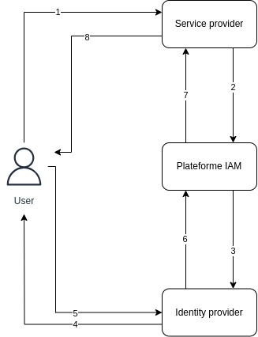
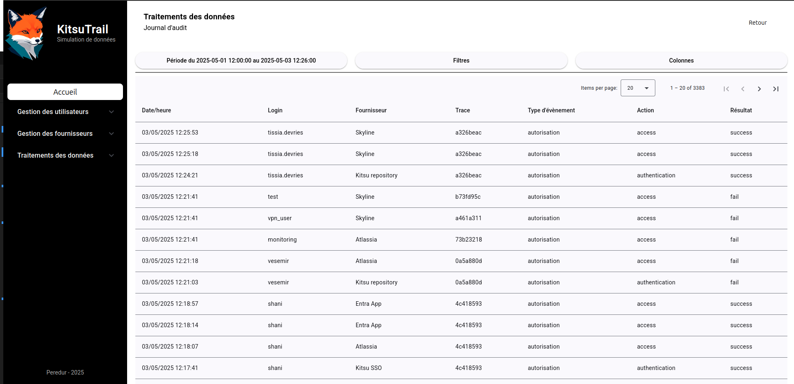

# Journal de bord

Notes lors du développement de la feature qui doit contenir les providers et les audit log.

## 2025-04-29 Démarrage (Providers)
J'ai passé pas mal de temps à développer la gestion des utilisateurs, qui n'est toujours pas finie mais est fonctionnelle pour ce que je veux faire.
Maintenant il faut que j'ajoute des providers (IDP et SP).

## 2025-04-30 Mise en place des pseudo providers (Providers)
Dans un premier temps, j'ai transformé le retour de la liste des providers `getProviders` en retour d'un observable. Cela pour préparer le cas où la liste des providers est également gérer par le backend.

Les composants `identities-list` et `services-list` on été adapté pour récupérer les fournisseurs correspondant (idp ou sp) et de les afficher en passant par un nouveau composant `provider-card`.
Pour le moment l'affichage de chaque fournisseur est un simple paragraphe. Cela sera amélioré par la suite pour coller à la charte graphique du site.

> Prochaine étape avancer sur les traces d'audit

## 2025-05-01 Démarrage (Audit log)
Activation du bouton pour l'accès au journal d'audit.
Puis préparation des routes et du composant qui va accueillir la liste des traces d'audit.

J'ai également ajouter un bouton Reports dans la partie traitement des données qui restera désactiver. C'est juste pour garder une trace de cette fonctionnalité.

Je dois maintenant réfléchir au format de ces traces. Pour le moment je pars sur un tableau pour l'affichage.

Pour cette feature, je vais à nouveau travailler avec le backend.

## 2025-05-04 Définition du format de l'audit log
On va réfléchir ici au format de l'audit log ainsi que de son contenu.
On peut logger les actions d'administration et les actions des utilisateurs sur la plateforme.

Imaginons la user story suivante (cf schéma ci dessous):
1. Un utilisateur tente d'accéder à une ressource (SP)
2. Le SP va demander l'autorisation à KT (Plateforme IAM) si l'utilisateur peut accéder au service
3. KT va demander à un fournisseur d'identité (IDP) si l'utilisateur peut s'authentifier
4. KT redirige l'utilisateur vers le moyen d'authentification de l'IDP
5. L'utilisateur s'authentifie sur la page de l'IDP
6. L'IDP donne le résultat à KT.
7. KT donne le résultat au SP
8. Le SP fournis la ressource à l'utilisateur



On a peut avoir les actions suivantes:
- une requête du SP vers KT (access_request)
- une requête de KT vers l'IDP (authentication_request)
- une réponse de l'IDP vers KT (authentication_reply)
- une réponse de KT vers SP (access_reply)

- création d'un utilisateur
- modification d'un utilisateur
- suppression d'un utilisateur

Les raisons d'un échec peuvent être:
- wrong_password
- user_unknown
- account_locked
- insufficient_rights

Première ébauche de champs:
| nom         | type      | nullable | valeurs possibles          | description                      |
|-------------|-----------|----------|----------------------------|----------------------------------|
| audit_id    | STRING    | required | (uuid.uuid4())[:8]         | identifiant de l'évènement       |
| timestamp   | TIMESTAMP | required | 2025-05-04 15:35:10:000000 | date heure de l'évènement        |
| categorie   | STRING    | required | management, autorisation   | type d'évènement                 |
| trace_id    | STRING    | required | (uuid.uuid4())[:8]         | relation entre plusieurs actions |
| action      | STRING    | required | (cf actions)               | évènement logger                 |
| user_id     | STRING    | nullable | e0e150a4                   | utilisateur concerné             |
| result      | STRING    | required | success, fail              | résultat de l'action             |
| reason      | STRING    | nullable | (cf raisons)               | raison d'un échec                |
| details     | STRING    | nullable | (cf details)               | informations complémentaires     |
| provider_id | INTEGER   | nullable | 1                          | identifiant du provider          |

Lors de récupération des logs il devrait être possible de faire la liaison avec les infos IDP et SP.
Finalement je pense que la mise en place des provider en base va arriver plus vite que prévue.

Les providers sont maintenant gérés directement depuis la base de données.
On a simplement ajouter des requêtes GET niveau API pour gérer la récupération des providers.

J'ai également préparé la table d'audit.
En utilisant les utilisateurs actuellement créé, on a commencé à remplir la base d'audit.
Maintenant je dois trouver un moyen de remplir cette table avec des activités.

Avec le schéma actuel, je vois les éléments suivant:
- les events `access_request` seront toujours en success
- les events `access_reply` peuvent échouer dans les cas suivants:
    * unknown_user              (inconnu dans KT)
    * account_locked            (bloqué dans KT)
    * missing_rights            (manquant dans KT)
    * (authentication_failed)   (échec avec IDP => découle d'`authentication_reply`)
    * authentication_timeout    (absence de `authentication_reply`)
- les events `authentication_request` seront toujours en success
- les events `authentication_reply peuvent échouer dans les cas suivants:
    * unknown_user              (inconnu coté IDP)
    * account_locked            (bloquer coté IDP)
    * wrong_credentials         (mauvais password)
    * missing_rights            (configuration IDP)
    * timeout                   (pas de réponse de l'utilisateur)

> Il faut maintenant faire un script qui va prendre en compte ces cas et les users/providers présent en base pour avoir quelque chose de cohérent.

## 2025-05-05 Réflexion sur le format des audit logs
Je pense que le format de l'audit log de management est bon.
Cependant, le niveau de détail pour la phase d'accès est trop important.
Les logs que j'ai proposé ressemblent plus à des logs applicatifs qu'à des logs d'audit.

Il faudrait aussi que toutes les informations soient présentes même si un IDP ou un utilisateur sont supprimé.
Par exemple on doit être en mesure de connaître l'utilisation d'un login, même si l'utilisateur a été créé puis supprimé.

Après réflexion, je pense partir sur les champs suivants:

| nom               | type      | nullable | valeurs possibles          | description                      |
|-------------------|-----------|----------|----------------------------|----------------------------------|
| timestamp         | TIMESTAMP | required | 2025-05-04 15:35:10:000000 | date heure de l'évènement        |
| audit_id          | STRING    | required | (uuid.uuid4())[:8]         | identifiant de l'évènement       |
| user_id           | STRING    | nullable | e0e150a4                   | utilisateur concerné             |
| user_login        | STRING    | nullable | triss.merigold             | login de l'utilisateur           |
| provider_type     | STRING    | nullable | idp, sp                    | type de provider                 |
| provider_id       | INTEGER   | nullable | 1                          | identifiant du provider          |
| provider_name     | STRING    | nullable | Kitsu SSO                  | nom d'affichage du provider      |
| provider_protocol | STRING    | nullable | SAML, OIDC, ...            | protocol utilisé                 |
| trace_id          | STRING    | required | (uuid.uuid4())[:8]         | relation entre plusieurs actions |
| source_ip         | STRING    | nullable | 145.168.154.1              | source de la requête             |
| source_admin      | STRING    | nullable | system                     | admin à la source de l'event     |
| category          | STRING    | required | management, autorisation   | type d'évènement                 |
| action            | STRING    | required | (cf actions)               | évènement journalisé             |
| result            | STRING    | required | success, fail              | résultat de l'action             |
| reason            | STRING    | nullable | (cf raisons)               | raison d'un échec                |
| info              | STRING    | nullable | (cf info )                 | informations complémentaires     |

**catégories/actions**:
- management
    * create_user, update_user, delete_user
- autorisation:
    * authentification - action auprès d'un IDP
    * access - action auprès d'un SP
    * logout - action auprès d'un IDP ou d'un SP

**results/reasons**:
- success
- fail:
    * unknown_user
    * account_locked
    * permission_denied
    * timeout
    * wrong_credentials

Il va falloir reprendre la table avec ces inputs

La table a été reprise, j'ai également ajouté la création des IDP et SP dans les logs d'audit. 
Maintenant je dois ajouter des activités à ces utilisateurs.

## 2025-05-06 Préparation des cas utilisateurs
La préparation des audits log pour l'activité des utilisateurs va comprendre plusieurs scenarii.

Rappel des `action` de la catégorie `autorisation`:
* *authentication* - action sur un IDP
* *access* - action sur un SP

`result`: *success* | *fail*

`reason` quand l'action fail:
* *unknown_user*
    * access seul > info = user inconnu dans KT
    * authentication (F) + access (F) > info = user unknown dans l'IDP
    * authentication (T) + access (F) > info = user unknown dans le SP

* *locked*
    * access seul > info = locked dans KT
    * authentication (F) + access (F) > info = user locked dans l'IDP
    * authentication (T) + access (F) > info = user locked dans le SP

* *timeout*
    * authentication (F) + access(F) > info = no user did not authenticate

* *permission_denied*
    * authentication (F) + access (F) > blocage IDP > info = IDP: detail dans info
        * *details*
            * role_missing
            * group_missing
            * attribut_mismatch
            * wrong_credentials
    * authentication (T) + access (F) > blocage SP > info = SP: detail dans info
        * *details*
            * role_missing
            * group_missing
            * attribut_mismatch


Voici les spécifications:
- Les premières actions commencent après la création de l'utilisateur ou du provider
- L'échec de l'authentification entraîne l'échec de l'accès, la reason et l'info ruissellent sur le logs d'accès
- Le trace_id lie une authentification avec plus demande d'accès (simulation de session)
- Si un access log est seul c'est que le blocage ou l'erreur est intervenue sur KT
- Même si une authentification est réussie, l'accès au SP peut échouer
- Pic de connexion à 8h et 13h
- Activité majoritaire entre 7h et 18 les jours de semaine
- Activité limitée le week end

Cas à générer:
1. auth OK - access_1 OK
2. auth OK - access_1 OK, access_2 NOK, ..., access_x OK (timeframe 5 minutes)
3. auth OK - access_1 NOK
5. access NOK
6. auth NOK - access_1 NOK

Pour faciliter la génération des logs j'ai organisé un peu mieux les modules dans la parte bdd sqlite.

Il me reste à traiter uniquement le cas ou l'accès échoue directement parce que l'utilisateur n'existe pas ou est bloqué sur la plateforme.

## 2025-05-09 Fin de la génération d'activité
Au bout de plusieurs jours de réflexion, j'ai enfin terminé le travail sur la génération automatique d'activité pour les traces d'audit.

Dans une premier temps, j'ai rapproché les créations d'utilisateurs, de plusieurs années à quelques mois.
Pour la partie développement c'est amplement suffisant.

L'initialisation de la table d'audit se déroule en plusieurs temps:
1. Génération des logs de création des utilisateurs, avec la date created_at dans la table user
2. Génération des logs de création de providers
    Le premier provider est systématiquement créé à minuit la veille de la création du premier utilisateur.
    Cela permet d'éviter des incohérences avec un SP utilisé avant sa création.
    J'ai ajouté un delta de 30 minutes entre chaque nouvelle création. Techniquement aucun provider ne sera créé après le premier utilisateur
3. Génération des logs d'activité par utilisateur
    - L'activité de chaque utilisateur commencera 1 minute après sa création (created_at)
    - La fréquence d'activité devrait être plus forte en jours de semaine entre 6h et 10h et entre 13h et 15h. Une activité toutes les 1 à 5 minutes contre toutes les 1 à 3 heures hors de ces période. Cela devrait simuler une activité de travail journalière et hebdomadaire.
    - Il y a 3 chances sur 5 que l'authentification se passe bien.
4. Génération de logs de monitoring
    - Il arrive parfois que des clients souhaitent monitoring la présence du service d'authentification en utilisant des comptes inconnu à interval régulier. Il y a donc 3 user_inconnu de la plateforme que tentent une authentification toutes les 5 minutes

Dans tous les cas, la génération d'activité ne va pas plus loin que le moment où le processus a été lancé.

> Prochaine étape, développer la partie API pour la récupération des données d'audit. Je peux éventuellement penser à ajouter un module de stats dans l'API

## 2025-05-12 Accès aux audit long depuis l'API
Pour pouvoir accéder aux log d'audit depuis l'interface graphique il va falloir développer le endpoint correspondant.

La recherche doit être possible selon les index mis en place dans la base. On pourra alors chercher sur les champs suivants:
- timestamp: entre 2 dates heures
- *Valeurs dans une liste*:
    - category
    - trace_id
    - action
    - result
    - user_id
    - provider_id
    - provider_name
    - provider_type
    - provider_protocol
Si présent chaque field sera ajouter avec un AND dans le WHERE de la requête SQL. Afin de limiter également les résultats je pense ajouter les informations limit et offset pour tenter de gérer la pagination mais en optionnel.

Pour celui là, je pense utiliser des informations de requêtes dans le body en json, qui aura a peut près cette forme
```json
{
    "filter": {
        "time_range": {
            "start": "YYYY-MM-DD HH:MM:SS",
            "end": "YYYY-MM-DD HH:MM:SS",
        },
        "category": ["autorisation"],
        "provider_protocol": ["SAML", "OIDC"]
    },
    "per_page": 50,
    "page": 2,
} 
``` 
Cela va donner la requête SQL suivante
```sql
SELECT
    *
FROM 
    audit_logs
WHERE
    timestamp >= "YYYY-MM-DD HH:MM:SS" AND  -- start
    timestamp <= "YYYY-MM-DD HH:MM:SS" AND  -- end
    category in ("autorisation") AND
    provider_type in ("SAML", "OIDC")
LIMIT 50
OFFSET 100 -- per_page * page
```

Notes:
- Il faudra que je fasse attention à la gestion de la casse.

Petit détail pour l'utilisation d'un ORM via SQLAlchemy, il faut obligatoirement une clé primaire, le grand gagnant est audit_id.

La partie récupération des audits backend est terminée.
J'ai majoritairement utilisé le BaseModel de `pydantic` pour construire les objets.
Cet outil semble assez puissant pour ajouter une vérification de type et la construction d'objet avec des schéma de données bien définissable.

Prochaine étape récupérer la liste des audit log dans l'interface graphique.

## 2025-05-13 Affichage des logs dans le Tenko (front)
La récupération des logs d'audit reprend les principes déjà mis en place pour la récupération des users et des providers.

Pas de nouveauté de ce point de vue.

Pour le moment le filtre est complètement intégrer dans la requête de base.
La prochaine étape sera de faire en sorte que ce filtre soit plus personnalisable.

## 2025-05-14 Généralisation du filtre des log d'audit
Pour le filtre, j'ai pu convertir les modèles du backend en interface pour le front.

Prochaine étape faire le tableau, je pense que je vais utiliser le composant table de material/@angular
[https://material.angular.dev/components/table/overview](https://material.angular.dev/components/table/overview)

Le tableau a été réalisé de manière complètement statique.
J'ai eu un peu de mal à utiliser mon observable comme source de données pour le tableau.
`[dataSource]` de `mat-table` n'accepte pas les tableaux vides. Par définition un observable est d'abord vide.
La solution est de s'abonner à l'observable dans le html avec async et un as le tout encapsuler avec un ngIf.
```     
<ng-container *ngIf="auditLogs$ | async as auditLogs">
```     

J'ai pu uniformiser le format d'affichage des timestamp avec DatePipe.

## 2025-05-15 Réflexion sur les tableaux
Techniquement, j'aimerais pouvoir ajouter un tableau d'activités dans la page de chaque utilisateur et de chaque provider.
Pour le tableau dans le Journal d'audit, j'aurais besoin d'ajouter:
- une gestion des dates/heures
- la définition des filtres
- contrôle de la pagination
- affichage de certaines colonnes

De base, `@angular/material` permet d'utiliser une source `MatTableDataSource` qui pour permettre de gérer facilement les filtres, et la pagination.
Mais pour ce faire il faut charger l'ensemble des données. Dans notre cas, on gère ces éléments dans le backend. 
Ca ne marche dont pas pour nous ici.

J'ai vu qu'il est possible de gérer dynamiquement l'affichage des colonnes via une boucle for.
A ce stade, je réfléchis comment déléguer les opérations du tableau à un module dédié et réutilisable.
Je peux éventuellement utiliser les services et les signaux pour faire passer les informations des modules vers le tableau.

##  2025-05-17 Travail sur le tableau
Le tableau d'audit a été déplacé dans son propre composant.
En argument il va prendre le filtre à appliquer ainsi que les colonnes à afficher. Ces éléments seront géré directement dans les composants appelant le tableau.

Autre modification majeure. Maintenant le tableau contient toutes les colonnes retournées par l'appel API. Elles sont toutes initialisées via une boucle for mais seules celles dont l'id est dans selectedColumns sera affichée.

Dans le cas de changement de champs cela implique de modifier `columns` dans `audit-table.component.ts`.

## 2025-05-20 Mise en place de la sélection du filtre (journal d'audit)
La session de travail a porté sur la mise en place d'un filtre coté frontend dans la page du journal d'audit.
Le but était de permettre à un utilisateur de sélectionner des filtres via l'interface et de mettre à jour le tableau des logs en fonction.

La page parente est dans `audit-logbook.component.ts` où on avait déjà ajouté 2 boutons (Filtres & Colonnes).
Ici les actions se portent que sur Filtres. Mais le même principe sera appliquer pour Colonnes.

Le bouton Filter déclenche l'ouverture d'un `dialog` contenant le formulaire `audit-filter.component.ts`.
A la fermeture du formulaire on récupère les nouvelles valeurs et on met à jour le filtre.
Le filtre est passé en input au composant dans `audit-table.component.ts`. Ce composant écoute les changement du filtre pour refaire si besoin la requête au backend.
Temps que l'utilisateur est sur le journal d'audit, on conserve la valeur du filtre appliqué et on le redonne au formulaire pour afficher les paramètres courants.

Au niveau du code ça donne les éléments suivants.

Dans `audit-logbook.component.ts`:
```typescript
export class AuditLogBookComponent implements OnInit{
  //...
  readonly dialog = inject(MatDialog);

  auditFilter!: AuditFilter;

  currentFilter: FilterFormData = {     // Interface FilterFormData dédiée pour les valeurs du formulaire
    actions: [],                        // filtre vide
    categories: []                      // ajouter dessous les nouveaux champs à filtrer
  }
  //...
  ngOnInit(): void {    
    //...
    this.buildAuditFilter();    // Initialisation du filtre vide au démarrage
  }

  private buildAuditFilter() { // Fonction pour la construction du filtre
    const filterData = this.currentFilter;
    this.auditFilter = {
      filter: {
        time_range: {
          start: '2025-05-01 00:00:00',
          end: '2025-05-10 00:00:00'
        },
        action: filterData.actions,
        category: filterData.categories
      }
    }
  }

  openFilter(): void {
    const dialogRef = this.dialog.open(AuditFilterComponent, {
      data: this.currentFilter  // Envoi des paramètres du filtres présent à dialog
    });

    dialogRef.afterClosed().subscribe((result: FilterFormData | undefined) => {
      if (result) {     // Récupération des résultat à la fermeture du formulaire
        this.currentFilter = result;
        this.buildAuditFilter()
      }
    })
  }
}
```

Dans `filter.model.ts`:
```typescript
export interface FilterFormData {
    actions: string[];
    categories: string[]; // ajouter dessous les nouveaux champs à filtrer
}
```

Dans `audit-filter.component.ts`:
```typescript
export class AuditFilterComponent implements OnInit{
  filterForm!: FormGroup;
  availableActions = ['access', 'authentication', 'create_user'];
  availableCategories = ['autorisation', 'management'];
  
  readonly dialogRef = inject(MatDialogRef<AuditFilterComponent>);
  private formBuilder = inject(FormBuilder);
  private filterData: FilterFormData | null = inject(MAT_DIALOG_DATA); // Récupération du currentFilter

  ngOnInit(): void {
    this. filterForm = this.formBuilder.group({
      actions: [this.filterData?.actions ?? []],        // Initialisation des valeurs (currentFilter)
      categories: [this.filterData?.categories ?? []]
    });
  }

  onNoClick(): void {
    this.dialogRef.close();
  }

  onFilter(): void {
    const actions = this.filterForm.get('actions')?.value;
    const categories = this.filterForm.get('categories')?.value;
    this.dialogRef.close({      // Retourner les données à la page parente
      actions: actions,
      categories: categories
    });
  }

  onReset(): void {
    this.filterData = null;     // vider filter data
    this.filterForm.reset();    // Reset le formulaire
    this.dialogRef.close({      // Retourner les données à l'appelant
      actions: [],
      categories: []
    });
  }
}
```

Pour rappel, le filtre dans `audit-table.component.ts` est utilisé dans un `ngOnChanges` qui va réagir aux changements de la valeur d'auditFilter
```typescript
export class AuditTableComponent implements OnChanges{
  private auditService = inject(AuditService);
  auditLogs$!: Observable<AuditEntry[]>;
  
  @Input() auditFilter!: AuditFilter
  //...
  ngOnChanges(changes: SimpleChanges): void {
    if (changes['auditFilter'] && this.auditFilter) {
      this.auditLogs$ = this.auditService.getAuditLogs(this.auditFilter)
    }
  }
}
```

Initialement, je n'avais pas prévu de mettre en place un filtre sur les catégories, mais l'ajouter m'a permis de me rendre compte de toutes les modifications à mettre en oeuvre dans ce cas.
- Frontend - `audit-filter`:
    - hmtl: `form-field`
    - ts: `filterForm`
    - ts: fonctions appelées par les boutons
- Frontend - `audit-logbook`:
    - ts: `currentFilter`
    - ts: `buildFilter`
- Frontend - `filter.models`:
    - ts: `FilterFormData`
- Backend - `models`:
    - py: `QueryFilter`
- Backend - `audit`:
    - py: `FILTER_FIELDS`


Prochaines étapes: 
1. Mettre en place le filtering pour tous les champs avec index
2. Permettre la sélection des colonnes
3. Gérer la pagination

## 2025-05-21 Mise en place de la sélection des colonnes
Documentations:
- [https://material.angular.dev/components/checkbox/examples](https://material.angular.dev/components/checkbox/examples)
- [https://angular.fr/reactive-forms/form-array](https://angular.fr/reactive-forms/form-array)


J'ai cherché un moyen d'afficher via une boucle for les différentes colonnes possibles.
L'utilisation de form-array ne m'a pas convaincu.
Cela correspond plus à la génération d'une liste dynamique dans le cadre de l'interaction avec l'utilisateur.
Je me suis donc rabattu sur la création d'une liste en dur. Cette liste est utilisée pour générer dynamiquement les formControl. Petit bonus la liste des colonnes sélectionnée est conservée au niveau du parent, on peut donc la réinjecter à l'ouverture du dialog.

```typescript
ngOnInit(): void {
  const controls: Record<string, FormControl<boolean|null>> = this.availableColumns.reduce(
    (acc, column) => {
      acc[column.id] = new FormControl(!!this.columnsData.includes(column.id));
      return acc;
    },
    {} as Record<string, FormControl<boolean|null>>
  );
  this.columnForm = this.formBuilder.group(controls);    
}
```

La conversion de l'objet retourné par le formulaire se fait avec l'instruction suivante:
```typescript
onSubmit(): void {
  const selectedColumns = Object.entries(this.columnForm.value)
    .filter(([_, isChecked]) => isChecked)
    .map(([columnId]) => columnId)    
  
    this.dialogRef.close(selectedColumns);
}
```

## 2025-05-22 Travail sur les filtres pour la table d'audit
Documentation: [https://material.angular.dev/components/chips/overview](https://material.angular.dev/components/chips/overview)

Pour certains champs du filtre, il n'est pas possible ou pertinent de mettre une sélection multiple.
C'est le cas pour:
- user_login
- user_id
- trace_id
- provider_name

Pour ces champs, je passe par un type de champ: les *chips*.
Ce champs permet de gérer une liste de string issue d'un input.
La modification de la liste passe par l'utilisation d'un signal.

Techniquement pour user_login ça se passe ainsi:
```typescript
export class AuditFilterComponent implements OnInit{
  //...
  readonly separatorKeysCodes: number[] = [ENTER, COMMA]; // séparateur d'éléments
  readonly filterLogins = signal<string[]>([]); // liste hébergeant les choix
  //...
  
  ngOnInit(): void {
    this.filterLogins.set(this.filterData?.user_login ?? []); // initialisation selon la valeur du parent

    this.filterForm = this.formBuilder.group({
      //...
      user_login: [this.filterLogins()],
      //...
    })
  onFilter(): void {
    this.dialogRef.close({
      //...
      user_login: this.filterForm.get('user_login')?.value, // récupération de la liste
      //...
    });
  }

  addLogin(event: MatChipInputEvent): void {  // ajoute le nouvel item
    const value = (event.value || '').trim();
    if (value) {
      this.filterLogins.update(logins => [...logins, value])
    }
    event.chipInput!.clear();   // nettoie l'input
    this.filterForm.get('user_login')?.setValue(this.filterLogins()); // met à jour le filterForm
  }

  removeLogin(login: string): void {
    this.filterLogins.update(logins => logins.filter(l => l !== login));
    this.filterForm.get('user_login')?.setValue(this.filterLogins());
  }
}
```

Et la le code html
```html
<mat-form-field>
    <mat-label>Login</mat-label>
    <mat-chip-grid #chipGrid aria-label="Login">
        @for (login of filterLogins(); track login){  <!-- boucle sur les valeurs ajoutée dans le signal -->
            <mat-chip-row (removed)="removeLogin(login)">
                {{ login }}
                <button class="remove-item" matChipRemove>
                    <mat-icon>cancel</mat-icon>
                </button>
            </mat-chip-row>
        }
        <input 
            [matChipInputFor]="chipGrid" 
            [matChipInputSeparatorKeyCodes]="separatorKeysCodes"
            [matChipInputAddOnBlur]="true"
            (matChipInputTokenEnd)="addLogin($event)"
            placeholder="Ajouter un login"
        />
    </mat-chip-grid>
</mat-form-field>
```

Lors de cette passe j'ai pu ajouter les filtres suivants:
- Sélection multiple
  - Résultats
  - Types de fournisseur
  - Protocols
- Chip
  - Login
  - Fournisseur (name)

> Prochaine étape la pagination, avec [https://material.angular.dev/components/paginator/overview](https://material.angular.dev/components/paginator/overview)

## 2025-05-23 Mise en place de la pagination
Le travail du jour va se porter sur la mise en place de la pagination pour le tableau d'audit

Je pense que l'opération se fera directement dans le composant audit-logbook et une modification coté backend sera sûrement nécessaire.

Finalement la mise en place de la pagination est ce qui m'a semblé le moins compliquer à mettre en oeuvre.

Dans un premier temps, j'ai modifié le backend pour qu'il retourne des métadonnées de pagination en plus des données.
Ca donne ça:
```json
{
  "items": [
    "..."
  ],
  "metadata": {
    "total_items": 0,
    "total_page": 0,
    "page": 0,
    "items_in_page": 0
  }
}
```

Au niveau du frontend, j'ai du effectuer les modifications suivantes:
- Ajout du nouveau modèle correspondant à la réponse attendue
- Mise à jour du modèle attendu pour le service *audit-service*
- Modification de la récupération des données
```typescript
  auditReply$!: Observable<AuditReply>;   // modification de l'observable
  entries: AuditEntry[] = [];   // les logs d'audit sont dans cette liste
  totalItems!: number;   // information nécessaire à la pagination
  
  // pagination par défaut
  pageSize =  20;
  pageIndex = 0;
  pageSizeOptions = [10, 20, 50];
  
  // logique de chargement des données déplacée dans cette fonction
  loadData(): void {
    // Mise à jour du filtre
    this.auditFilter.page = this.pageIndex + 1;   
    this.auditFilter.per_page = this.pageSize;

    // Récupération des données via API
    this.auditReply$ = this.auditService.getAuditLogs(this.auditFilter).pipe(
      tap((reply: AuditReply) => {
        this.entries = reply.items;
        this.totalItems = reply.metadata.total_items;
      })
    );
  }

  onPageEvent(event: PageEvent): void {
    // Récupération des actions de pagination
    this.pageIndex = event.pageIndex;
    this.pageSize = event.pageSize;
    this.loadData();
  }
```

```html
<mat-paginator #paginator
    (page)="onPageEvent($event)"
    [length]="totalItems"
    [pageSize]="pageSize"
    [pageSizeOptions]="pageSizeOptions"
    [pageIndex]="pageIndex"
    showFirstLastButtons="true">
</mat-paginator>
```

> Prochaine étape la gestion du range de recherche


## 2025-05-25 Mise en place du sélecteur de plage date/heure
Documentations:
 - [https://material.angular.dev/components/timepicker/overview](https://material.angular.dev/components/timepicker/overview)
 - [https://material.angular.dev/components/datepicker/overview](https://material.angular.dev/components/datepicker/overview)


Le but de cette étape est de permettre à l'utilisateur de sélectionner plus précisément une plage d'intérêt pour la visualisation des logs d'audits.
J'ai décidé de reste sur l'utilisation du module `@angular/material`.
La sélection de cette plage n'est possible que dans le logbook.

Le module `material` met à disposition 2 composants (datepicker & timepicker).
Il n'a pas de composants qui permette de gérer les deux directement. J'ai donc du composé avec ces deux là.
Le composant timepicker ne permet d'avoir une granularité à la seconde, ce qui peut être dérangeant lors des investigations.
Je changerais peut être si je trouve un meilleur module de gestion du temps.

Un certain nombre de modifications ont été apportées pour mettre en place cette logique.
D'abord j'au du ajouter une nouvelle dépendance:
```
npm install moment @angular/material-moment-adapter
```

Dans `app.config.ts`, j'ai mis en place un format de date/heure custom pour éviter d'avoir le format américain MM/DD/YYYY.
```typescript
export const CUSTOM_DATE_FORMATS = {
  parse: {
    dateInput: 'YYYY-MM-DD',
    timeInput: 'HH:mm'
  },
  display: {
    dateInput: 'YYYY-MM-DD',
    timeInput: 'HH:mm',
    timeOptionLabel: 'HH:mm',
    monthYearLabel: 'YYYY-MM',
    dateA11yLabel: 'YYYY-MM-DD',
    monthYearA11yLabel: 'YYYY-MM',
  }
};

export const appConfig: ApplicationConfig = {
  providers: [
    // ...
    { provide: DateAdapter, useClass: MomentDateAdapter, deps: [MAT_DATE_LOCALE, MAT_MOMENT_DATE_ADAPTER_OPTIONS] },
    { provide: MAT_DATE_FORMATS, useValue: CUSTOM_DATE_FORMATS },
    { provide: MAT_DATE_LOCALE, useValue: 'fr' }
  ]
};

```

Dans `audit-logbook`, j'ai ajouté un nouveau bouton quoi ouvre un *dialog* comme pour la sélection des Filtres et des colonnes.
Petite particularité pour ce bouton, il va afficher les valeurs de dates de début et de fin directement dans l'interface.
Je définis dans le *init* une plage par défaut en dure pour le moment. A terme l'idée serait de faire une gestion dynamique de type la dernière heure.
Le programme ne génère pas de données en continue, il n'y a donc pas d'urgence de l'ajouter maintenant.

Les modifications dans le TS
```typescript
export class AuditLogBookComponent implements OnInit{
  // ...
  currentTimeRange: FilterTimeRange = {   // Nouvel attribut avec une valeur par défaut
    start: "2025-05-01 00:00:00", // La gestion du str est réalisée dans le module TimeRangeFilterComponent
    end: "2025-05-05 00:00:00"
  };

  // ...
  private buildAuditFilter() {
    const filterData = this.currentFilter;

    this.auditFilter = {
      filter: {
        time_range: this.currentTimeRange, // ajout des infos de time range dans le filtre pour l'API
        action: filterData.actions,
        // ...
      }
    };
  }

  // ...
  openTimeRange(): void {
    const dialogRef = this.dialog.open(TimeRangeFilterComponent, {
      data: this.currentTimeRange
    });

    dialogRef.afterClosed().subscribe((result: TimeRangeFilter | undefined) => {
      if (result) {
        this.currentTimeRange = result;
        this.buildAuditFilter();
      }
    });
  }

}

```

Et dans le HTML
```html
<button mat-raised-button (click)="openTimeRange()">Période du {{ currentTimeRange.start }} au {{ currentTimeRange.end }}</button>
```

Maintenant que les bases sont posées on peut s'occuper du module de sélection de date a proprement parlé.
Comme pour les filtres et les colonnes ont récupère la plage courante.
La particularité est qu'il faut effectuer des transformations pour que les données puissent être réinjectée dans les form-fields
Le composant va recevoir une chaîne `YYYY-MM-DD HH:mm:ss`.
Le *date picker* peut se débrouiller avec `YYYY-MM-DD`.
Par contre *time picker* récupère un objet `Date`.

On applique donc les transformations suivantes lors du *init*.
```typescript
  ngOnInit(): void {
    const [startDateData, startTimeData] = this.timeRangeData.start.split(' '); 
    const [endDateData, endTimeData] = this.timeRangeData.end.split(' '); 

    const [startHours, startMinutes, startSeconds] = startTimeData.split(':');
    let curStartTime = new Date();
    curStartTime.setHours(Number(startHours), Number(startMinutes), Number(startSeconds));
    
    const [endHours, endMinutes, endSeconds] = endTimeData.split(':');
    let curEndTime = new Date();
    curEndTime.setHours(Number(endHours), Number(endMinutes), Number(endSeconds));
    
    this.timeRangeForm = this.formBuilder.group({
      startDate: [startDateData, Validators.required],
      endDate: [endDateData, Validators.required],
      startTime: [curStartTime, Validators.required],
      endTime: [curEndTime, Validators.required]
    }, { validators: this.timeRangeValidator });
  }
```
Dans ce *init* on défini également le form-group avec un validateur qui va vérifier que la date/heure du début est bien inférieure à la date de fin.
```typescript
  timeRangeValidator(group: AbstractControl): ValidationErrors | null {
    const startDate = group.get('startDate')?.value;
    const endDate = group.get('endDate')?.value;
    const startTime = group.get('startTime')?.value;
    const endTime = group.get('endTime')?.value;

    if (startDate && endDate && startTime && endTime) {
      const start = new Date(startDate);
      const startTimeTmp = new Date(startTime);
      start.setHours(startTimeTmp.getHours(), startTimeTmp.getMinutes(), 0, 0)

      const end = new Date(endDate);
      const endTimeTmp = new Date(endTime)
      end.setHours(endTimeTmp.getHours(), endTimeTmp.getMinutes(), 0, 0);

      if (start > end) {
        return { invalidRange: true };
      }
    }
    return null;
  }
```
La gestion du format d'affichage des dates est gérée directement ici pour avoir une chaine directement compatible avec SQL.
J'utilise une fonction qui permet de gérer l'affichage et le padding avec la manipulation des objets *Date*.

```typescript
function formatDateTime(date: Date, time: Date): string {
  const padding = (n: number) => n.toString().padStart(2, '0');

  const year = date.getFullYear();
  const month = padding(date.getMonth() + 1);
  const day = padding(date.getDate());
  const hours = padding(time.getHours());
  const minutes = padding(time.getMinutes());

  return `${year}-${month}-${day} ${hours}:${minutes}:00`;
}
```

Enfin, la fonction onSubmit permet d'envoyer les données dans le format final
```typescript
  onSubmit(): void {
    const newStartDate = new Date(this.timeRangeForm.get('startDate')?.value);
    const newStartTime = new Date(this.timeRangeForm.get('startTime')?.value);
    
    const newEndDate = new Date(this.timeRangeForm.get('endDate')?.value);
    const newEndTime = new Date(this.timeRangeForm.get('endTime')?.value);

    this.dialogRef.close({
      start: formatDateTime(newStartDate, newStartTime),
      end: formatDateTime(newEndDate, newEndTime),
    });
  }
```
Et enfin un aperçu:


La prochaine étape étant la réalisation des tableaux de bords ce journal de bord dédié aux features est maintenant clôturé.