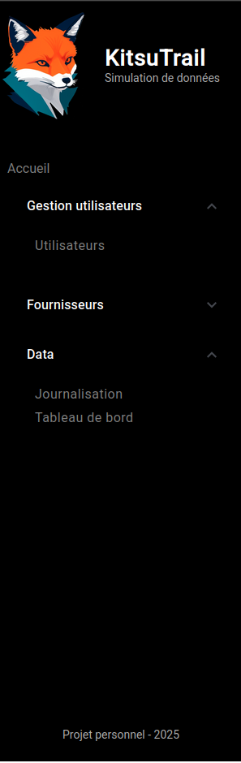

# Journal de bord

Fichier de suivis et notes informatives tout au long du développement du projet.

Le projet à pour objectif d'insérer des éléments de tableaux de bords dans une application Web existante ou pseudo existante.
La plateforme cible utilise Angular et est déployée dans une infrastructure Cloud.

Avant le début du projet j'ai commencé à apprendre Angular sur les sites suivants:
- https://angular.dev/
- https://openclassrooms.com

L'idée principale est de développer une application Angular qui va permettre à un utilisateur d'ajouter des lignes de log d'audit pour simuler des actions utilisateurs sur une plateforme de gestion des accès.

Une fois cette plateforme en place, il sera alors possible de travailler sur l'ajout des tableaux de bord et rapport qui vont se baser sur les logs renseigner par les utilisateurs.

Initialement, je compte utiliser les technologies suivantes:
- Frontend: Angular (nécessité technique)
- Backend: Python (Affinité avec le langage et approfondissement des mes connaissances)
  * Facilité d'intégration de modèle IA
  * FastAPI: (apprentissage de la mise en place d'un serveur API)
- Base de données: (Choix final à définir)
  * Postgres SQL: base de données puissante et connue
  * MongoDB: base noSQL flexible et facilement transférable dans le cloud (Cloud Atlas)
- Docker: (Utiliser pour le développement) 

Pour ce projet j'utilise également des plateformes d'IA générative (chatGPT & MistralAI) pour effectuer des recherches ou accélérer le processus de debugging. Aucun code généré par ces plateformes n'est inséré tel quel dans le code.

## 2025-03-23 - Initialisation du projet
Démarrage officiel du projet avec la création des répertoires de l'architecture globale du projet avec les répertoires frontend, backend et database.
J'ai également ajouté ce fichier journal de bord, des fichiers README et une licence MIT pour être complètement OpenSource.

L'ensemble du projet a été poussé dans github: [https://github.com/peredur0/KitsuTrail](https://github.com/peredur0/KitsuTrail)

Le nom du projet est KitsuTrail, Kitsu en référence au renard et Trail pour la piste. Je tente également de créer le logo de la plateforme avec de l'IA générative.
J'utilise le modèle Dreamshaper8 avec une instance local InvokeAI, pour générer un logo.

**Démarrage du développement du frontend**
- Utilisation de node 18 `nvm use 18`
- Utilisation d'Angular 19 `npm i -g @angular/cli`
- Création de l'application angular (sans tests pour le moment) `ng new KitsuTrail --style=scss` (Sans SSR)
- Draft du design à l'aide de Moqups [https://app.moqups.com](https://app.moqups.com) 

**Mise en place de l'architecture et des premiers composant**
- core: répertoire pour les modules de base de l'application
  - components
    - header: entête du site
    - landing-page: page d'accueil
    - sidebar: barre de navigation latérale
- features: répertoire des fonctionnalités de l'app
  - users: composant spécialisé dans la gestion des utilisateurs
    - components
      - users-list: liste des utilisateurs

L'ajout du composant user-list va simplement permettre de vérifier la bonne configuration du routing dans cette phase.
Je garde aussi cette page comme exemple de lazy-loading pour plus tard.
Les guards ne sont pas en place pour le moment.

**Mise en forme globale**
Préparation CSS des 3 éléments principaux de l'affichage.
1. Barre latérale
  * Mise en forme du header avec l’icône, un titre et un sous-titre
  * Préparation liens et des menus déroulants
  * Mise en place d'un pied de page qui va contenir le nom de l'utilisateur
2. Entête
  * Elle va servir à transmettre des informations à l'utilisateur
3. Contenant principal
  * c'est la que les actions de l'utilisateur vont se dérouler.

Le favicon a également été changé.

Le logo et le favicon ont été généré par IA (voir plus haut), des modifications mineures, principalement de la transparence, ont été réalisées avec GIMP.

> Fin de travail:
> Prochaine étape gérer les menus déroulants de la barre latérale


## 2025-04-24 - Travail sur la barre latérale
L'idée est d'ajouter des menus retractable dans le sidebar.
Le module Angular Material offre cette possibilité [https://material.angular.io/](https://material.angular.io/)
```
ng add @angular/material
```
Documentation sur les expansion panel : [https://material.angular.io/components/expansion/overview](https://material.angular.io/components/expansion/overview)

La mise en place des menu retractable est assez simple.
Tout comme la modification des éléments graphique.
L'installation du module va ajouter des données dans le fichier style global. Il est alors possible de faire un override dans le CSS du component.

J'ai ajouté des liens fictifs afin de donner un peu de corps à la barre latérale.

> **Difficultés**:
> 1. Je ne suis pas parvenue à gérer correctement l'espacement entre le header du menu retractable et le premier item de la liste en dessous
> 2. Le div central de la sidebar n'est pas scrollable. Sur des fenêtres petites certains menu peuvent se retrouver masqués

Résultat en image:




> Le travail de ce jour a été principalement HTML et CSS et uniquement sur la barre latérale. Demain on vas essayer de construire la page d'accueil ou la gestion des utilisateurs


## 2025-03-25 - Travail sur la page d'accueil et le header
- Renommage du répertoire Angular de KitsuTrail en Shiro (blanc)
- Préparation du nom du backend (Kuro)

Actions sur la page d'accueil:
- Mise en place de boite et des boutons qui vont être utilisée pour permettre de se rendre sur les pages de l'application

## 2025-03-26 Amélioration du code de la page d'accueil
- Mise en place d'un service unique pour gérer l'affichage et la présence des menus dans la sidebar et la landing-page.
> Prochaine étape utiliser ce service dans l'affichage avec des ngFor et ngIf. L'objectif est d'avoir un code le plus modulaire possible

Les menus de la landing page sont maintenant beaucoup plus modulaires.
Les propriétés de chaque menu sont maintenant gérées dans un service.
L'affichage se fait avec une boucle @for dans le template html.
Selon la propriété display du menu je suis capable d'afficher ou non un menu avec l'instruction @if.
J'ai également utiliser l'instruction *ngFor dans une balise article pour s'occuper de l'affichage des boutons.

Je dois maintenant appliquer du CSS sur ces boutons.

L'étape d'après sera de remplacer le code statique dans la sidebar.
Le code statique de la sidebar a été replacé par la version modulaire.
Les menus et la forme des liens sont maintenant gérés de manière centralisée via le service *menu.service*.
Il est possible de masquer complètement un menu en jouant sur la propriété *display*.
La propriété *disabled* de liens va voir une action via sur le CSS.

Le résultat à ce stade est:


> Prochaine étape gérer le header pour qu'il affiche un texte particulier selon la page sur laquelle se trouve l'utilisateur.

## 2025-03-27 Travail sur le header
Le but est de modifier le header dynamiquement en fonction de la page sur laquelle l'utilisateur se trouve.
Pour ce faire j'ai décidé d'utiliser les signaux.
> Cela va demander d'ajouter le service gérant les signaux dans tous les composants.

Documentation sur laquelle je me suis appuyé:
- [https://angular.dev/guide/signals](https://angular.dev/guide/signals)
- [https://angular.dev/essentials/signals](https://angular.dev/essentials/signals)
- [https://angular.dev/essentials/templates](https://angular.dev/essentials/templates)
- [https://angular.fr/signals/](https://angular.fr/signals/)

Pour une meilleure scalabilité, je vais essayer d'ajouter la récupération de l'url pour déterminer à partir du service menu quels éléments sont à afficher.

une piste : 

## 2025-03-28 Travail sur la location
En utilisant la méthode location.back(), j'ai pu ajouter un bouton retour dans le Header.
J'ai du faire une petite manipulation pour que le retour reste quand même sur l'application, en utilisant la propriété `window.history.length`.

Pour le moment je suis capable d'afficher le path courant, mais je dois importé le module location dans tous les composants dans lequel je souhaite l'utiliser.
J'aimerais pouvoir utiliser cette capacité pour modifier dynamiquement le contenu du header.
Le titre dans le header devrait être le nom de section (Gestion des utilisateur) en fonction des valeurs MenuService.
Le sous titre par contre pourra être codé en dur dans la page ou être variable selon le contenu (informations utilisateur).

Quelques ressources de cette partie:
- [https://angular.fr/routing/location](https://angular.fr/routing/location)
- [https://angular.dev/api/common/Location](https://angular.dev/api/common/Location)


La mise en page globale est en place pour le header.

Je n'ai pas réussi à terminer complètement le traitement du path courant.
Je continuerais demain

## 2025-03-29 Travail pour le dynamisme des pages
Aujourd'hui on va essayer de faire passer la page courante dans le setTitle du header pour récupérer la première page qui correspond à la section (users/Fournisseurs, Data)

J'ai utilisé les snapshots de ActivatedRoute.
J'ai pu tester l'utilisation de la fonction de mise à jour du header au sein de page principale des utilisateurs.
Vu que cette page est lancée en lazy-loading, il est nécessaire de passer par pathFromRoot[].

L'idée maintenant est d'exporté les instructions de modification du header dans une fonction de service dédiée.
Je vais déporté ces instructions dans le service du header.

En définitive, je pense déporter toute l'execution de la mise à jour du header dans le header et laisser chaque module définir éventuellement un sous titre.
Je regarde cette documentation pour le moment
- [https://angular.fr/routing/input-binding](https://angular.fr/routing/input-binding)

Finalement, je passe par une subscription sur les évènements de router directement dans le TS du header.
Je récupère l'URL final après la fin des opérations de navigation.

A ce stade, les titres affichés dans le Header sont totalement autonomes.
Je laisse la modification du sous titre dans chaque composant.
Cette opération utilise les signaux.

> A faire un petit résumé des solutions mises en place.

## 2025-03-30 Rédaction d'un bilan d'étape
Voir [20250330_front.md](./progress_summary/20250330_front.md).

**Prochaine étape**: Préparer le POC pour la gestion des utilisateurs et des fournisseurs avant la mise en place d'un backend.


## 2025-03-31 Mise en place des utilisateurs
Début de l'implémentation des utilisateurs.
- Création d'une classe User pour définir les attributs utilisables.
- Création d'un service pour gérer la liste des utilisateurs
- Ajout de quelques utilisateurs en dur dans le service
- Mise en place d'une méthode pour la récupération par id ou par login

Les utilisateurs ont pour le moment les attributs suivants:
- id: version tronquée d'un UUID (généré à la création)
- createdAt: date de création (généré à la création)
- firstname: prénom
- lastname: nom de famille
- login: str
- email: information optionnelle

2 méthodes pour set l'email: setEmail & withEmail.

## 2025-04-01 Travail sur les utilisateurs
Ajout d'une méthode pour normaliser l'affichage du nom d'affichage.

L'affichage de la liste des utilisateurs sera fait sous forme de cartes.
Peut être en présentant une photo de profil.
Je prévois également de rajouter une barre de recherche et des filtres.

Chaque utilisateur aura également sa propre page avec les informations relatives à son profil.

## 2025-04-02 Travail sur la liste des utilisateurs.
Les utilisateurs sont maintenant affichés dans des "cartes" de taille fixe dans la liste des utilisateurs.
J'utilise une grid pour organiser l'affichage des cartes utilisateurs.
L'instruction `grid-template-columns: repeat(auto-fit, minmax(200px, 1fr));` permet d'avoir une grille avec des colonnes d'une taille minimum de 200px et avec une largeur maximale qui va dépendre de la taille disponible.

La taille des cartes est de 200px et inclus les informations:
- image de profil
- Prénom NOM
Je pense également ajouter le login assez rapidement.
Les cartes sont clickable et vont amener vers la page de l'utilisateur

## 2025-04-03 Dynamisation de l'accès aux utilisateurs
J'ai modifié l'instruction SCSS grid-template-columns pour fixer à 200px la largeur des colonnes.
Cette organisation me plait plus notamment quand il peu d'utilisateur affiché.

J'ai ajouté la route vers le composant user quand l'utilisateur clique sur une carte.
Il faut que je trouve un moyen de rentrer la définition de la navigation dynamique au niveau de la section.
Un peu dans le même esprit que ce que j'ai fais pour le header.
La modification doit se faire dans le composant user-card je pense.

Je vais peut être devoir également modifier mon service users pour retourner des observable plutôt que des list et des objets User.
J'ai également vu que l'ajout d'un service passe maintenant par l'utilisation d'inject au lieu d'un constructeur.

Le basculement de la liste des utilisateurs à un observable attendra le développement du moteur API.
Pour le moment, j'ai réussi à rendre dynamique le déplacement vers la page d'un utilisateur en utilisant `router.navigate([router.url,...])`

Le passage de l'attribut id se fait avec `withComponentInputBindind`, cela a nécessité des modifications dans `app.config`. Mais il semblerait que cette méthode soit plus récente que l'utilisation de `ActivatedRoute`.
- [https://angular.fr/routing/input-binding](https://angular.fr/routing/input-binding)

J'en profite également pour remplacer tous les `constructor` par des `inject`. Mais une passe globale sur le code sera nécessaire pour effectuer tous les remplacements.
Il semblerait également que `inject`soit plus récent.

> Prochaine étape: le formulaire de création d'un utilisateur.

## 2025-04-06 Formulaire de création d'un utilisateur.
On va continuer avec l'utilisation d'Angular Material avec l'ajout de boite de dialogue.
- [https://material.angular.io/components/dialog/overview](https://material.angular.io/components/dialog/overview)
- [https://material.angular.io/components/form-field/examples](https://material.angular.io/components/form-field/examples)

Le bouton pour l'ajout d'un utilisateur a été mis en place au sommet de la liste des utilisateurs. Pour ce faire j'utilise un style de bouton défini dans le module Material `mat-raised-button`. Le click sur ce bouton ouvre une boite de dialogue contenant un formulaire qui doit être dynamique. 

Pour ce formulaire d'ajout d'utilisateur, j'utilise les modules:
- FormBuilder
- FormGroup
- ReactiveFormsModule
- Validator

Il y a un validateur sur les champs:
- login (required)
- email (doit être de la forme email)

Si les validators ne sont pas satisfait, le bouton pour envoyer le formulaire est désactivé.
A terme j'aimerais afficher un message expliquant si il y a une erreur. Pour le moment c'est un échec. 
Ou alors, je dois séparer chaque champ et j'aurais peut être plus la possibilité de valider tout le formulaire.

On va essayer de terminer pour ce soir avec la finalisation de l'ajout de la création de l'utilisateur.
> L'ajout d'un utilisateur est fonctionnel. Il faut maintenant passer par un vrai backend pour gérer la liste des utilisateurs comme un observable

La création d'un utilisateur se déroule de la manière suivante:


## 2025-04-23 Liaison front et back
La récupération des users passe maintenant par l'utilisation de requêtes HTTP.
J'ai du ajouter un provider globalement dans app.config.ts.

Puis toutes les requêtes sont mises en place dans le service users `users.service.ts`.
J'ai du retirer la fonction getDisplayName du modèle `users.model.ts`. Elle a été déplacée dans un module annexe `user-utils.ts`.

Maintenant que la récupération des utilisateurs (single ou liste) se fait via des observables, j'ai également du modifier le code qui utilisait ces ressources.
Les fichiers modifiers sont:
- user.component(.html|.ts)
- user-card.component(.html|.ts)
- users-list.component(.html|.ts)

J'ai eu un peu de mal a passer la version displayName au sous titre du header. L'objet user est maintenant un observable sur lequel il faut faire un pipe et y souscrire le temps que la page est ouverte.

Prochaine étape rétablir la fonction d'ajout de l'utilisateur et le bind sera complet.

## 2025-04-29 restauration de la fonction d'ajout d'utilisateur
L'application va maintenant utiliser le endpoint `/users/` pour créer un utilisateur via un post. J'ai donc le code suivant pour addNewUser (users.service.ts):
```typescript
return this.http.post<User>('http://localhost:8000/users/', userData);
```

La validation se fera dans le formulaire. Je dois avouer que j'ai eu besoin de chatGPT pour la modification de la fonction onAddUser().
J'ai encore du boulot sur les observable.
Je vais donc détailler chaque instruction de la fonction.

Le début:
```
async onAddUser(): Promise<void> {
    const login = this.userForm.get('login')?.value;
    if (!login) return;
```
onAddUser() devient une asynchrone et va attendre le résultat de plusieurs appels vers le backend.
La première opération est la récupération du login et un return s'il est absent. (cela ne devrait pas arriver car il y a une validation sur le champs login).

La logique commence maintenant. L'idée est d'aller vérifier si le login est présent dans la base. Si c'est le cas ça veut dire qu'un utilisateur existe déjà, il faut donc invalider le champs login et bloquer l'envoi du post.
Si on a une erreur 404 ça veut dire qu'on peut créer un nouvel utilisateur.
```
try {
      await firstValueFrom(this.usersService.getUserFromIdentifier('login', login));
      this.userForm.get('login')?.setErrors({ loginTaken: true });
```
Avec l'appel `firstValueFrom` on transforme l'observable retourné par `getUserFromIdentifier` en Promise que l'on va attendre avec await.

```
catch (error: any) {
      if (error?.status === 404) {
        try {
          await firstValueFrom(this.usersService.addNewUser(this.userForm.value));
          this.dialogRef.close();
        } catch (postError: any) {
          console.error('Failed to create user', postError);
          alert("Echec de la création de l'utilisateur");
        }
```
Dans le cas où l'utilisateur n'existe pas, on applique la même logique du await sur l'ajout du nouvel utilisateur. Cela nous permet ensuite de capturer les erreurs éventuelles retournées par le backend.
Si l'ajour fonctionne on peut fermer la fenêtre de dialogue, sinon on lève une alerte.

```
} else {
        console.error('Failed to create user', error);
        alert("Echec de la création de l'utilisateur");
      }
    }
  }
```
Enfin on lève une alerte sur n'importe quelle autre erreur

Petit ajout. J'ai souhaité que la liste des utilisateurs se mettent à jours dès qu'un nouvel utilisateur est ajouté.
Pour ce faire, on commence par définir un Subject (observable et observer) qui va émettre une notification à l'abonné comme quoi il y a eu du changement. Dans `users.service.ts`:
```
private usersChanged = new Subject<void>();
usersChanged$ = this.usersChanged.asObservable();

notifyUsersChanged(){
        this.usersChanged.next();
    }
```

Dans le composant qui gère l'ajout de l'utilisateur on va ajouter la ligne
```
this.usersService.notifyUsersChanged();
```
qui va envoyer la notification comme quoi les utilisateurs on changé

On récupère cette notification dans `users-list.component`.
```
this.userService.usersChanged$.subscribe(() => {
  this.users$ = this.userService.getUsers();
})
```

