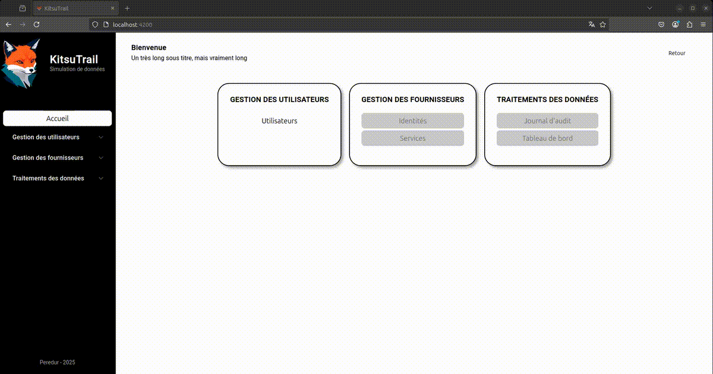

# Bilan d'étape 1 : FrontEnd

>**Rappel**: Le projet vise à implémenter des graphiques de visualisation de données dans une application simulant une plateforme de gestion d'identité est d'accès (IAM).

### Architecture globale
L'architecture générale de l'application a été préparée lors du travail sur le frontend:
```plaintext
KitsuTrail
├── docs
│   ├── img
│   └── journal_de_bord.md
├── infra
│   ├── kt_backend
│   ├── kt_database
│   └── kt_frontend
|       └── Tenko
├── LICENSE
└── README.md
```
Cette architecture a pour but de séparer efficacement les différents composants attendus du projet.
- frontend Angular
- backend Serveur API (fastApi)
- base de données (SQL, MongoDB)


L'organisation des branches git sera la suivante:
- une branche de production (main)
- une branche de développement global (develop)
- une branche pour le développement du front end (kt_frontend)
- une branche pour le développement du back end (kt_backend)

```plaintext
*─ A  (main)
      \
       └─ B  (develop)
          \
           ├─ C ── D  (kt_frontend)
           └─ E ── F  (kt_backend)
```
La branche develop, devrait me permette de conserver une production stable tout en ayant la possibilité de merger les évolutions du front et du back end.

> **Notes**: Les noms de l'application vont tourné autour de noms relatifs aux renards dans une thématique nippone.
> - KitsuTrail - mélange de Kitsune (renard en japonais) et Trail (piste) pour le suivi des données.
> - Tenko - pour le frontend
> - Kuko - pour le backend
> 
> Le code couleur reprend les couleurs du renard: Noir, Blanc & Roux.
> Si un version dark devait voir le jour elle sera sur une base de bleu nuit.

### Frontend (Tenko)
L’arborescence de l'application Angular s'organise de la manière suivante:
```plaintext
Tenko
├── public/
└── src/
    ├── app/
    |   ├── core 
    |   |   ├── components
    |   |   |   ├── header
    |   |   |   |   └── (.html .scss .ts)
    |   |   |   ├── landing-page
    |   |   |   |   └── (.html .scss .ts)
    |   |   |   └── sidebar
    |   |   |       └── (.html .scss .ts)
    |   |   ├── models
    |   |   |   └── menu.model.ts
    |   |   └── services
    |   |       ├── header.service.ts
    |   |       └── menu.service.ts
    |   ├── features
    |   |   └── users
    |   |       ├── components
    |   |       |   └── users-lists
    |   |       |       └── (.html .scss .ts)
    |   |       └── users.routes.ts
    |   ├── app.component(.html .scss .ts)
    |   ├── app.config.ts 
    |   └── app.routes.ts
    ├── assets/
    ├── index.html
    ├── main.ts
    └── styles.scss
```
Les fonctions générales du site sont gérées dans le module *core*.
Le header et la barre latérale seront toujours présentes quelque soit la page ou l'action effectuée par l'utilisateur.
Le contenu des différentes pages sera affichés dans l'espace restant.
Cette répartition est décrite dans `app.component.html`, le style global dans `app.component.scss`.

Le *header* se compose d'un titre et d'un sous titre dynamique qui est mis à jour selon la page (URL) sur lequel l'utilisateur se trouve. Il y a également un bouton Retour qui permet de revenir sur la page précédente.
- Le bouton Retour utilise la fonction `location.back()` du module `Location : @angular/common`. Il faut prendre en compte que cette fonction peut éventuellement faire sortir du site. Mais c'est gérable avec l'utilisation de `windows.history.length`. cette solution semble fonctionnelle sur firefox, a voir si elle fonctionne aussi sur d'autre navigateur. 

- La dynamisme du titre et du sous titre passe par l'utilisation d'un service qui utilise le module `signal : @angular/core` pour mettre à jour et transmettre les variables `title` & `subtitle`. Le header met à jour ses propres instance avec la méthode `computed` du même module. Si la mise à jour du sous titre est géré directement depuis la page qui est affichée, le titre se met à jour en fonction de l'URL actif. Après plusieurs essais, j'ai décidé de passer par la souscription l'observable des events du `Router : @angular/router`. J'ai une petite transformation à faire après avoir eu l'`urlAfterRedirects` mais avec cette méthode, je récupère facilement l'ensemble de l'URL que je peux facilement matcher avec le service gérant les menus. La solution avec `ActivatedRoute` n'a pas été retenue à cause de la complexité de récupération de l'URL parente dans un composant enfant (lazy loading).   

La *sidebar* comporte le logo de l'application, un bouton pour se rendre directement sur la page d'accueil, une liste de menu extensible pour se rendre sur les différentes pages de l'application et un footer.
- La présentation des menus avec les liens associés est géré par le module `MatExpansionModule : @angular/material/expansion`. Ici on utilise des boucles `@for`, `*ngFor` et des instructions `@if` pour afficher les menus et les liens qui doivent l'être.

- Le bouton d'accueil utilise simplement l'attribut `routerLink` de `RouterModule : @angular/router`.

La *landing-page* est un affichage des différents menus/sections avec des boutons pour amener vers les pages souhaitées.
- Cette page présente les menus disponibles dans le même service que celui de la sidebar. La logique d'affichage est similaire. 

Le *service menu* centralise la gestion et la distribution des informations sur les menus dont vont dépendre l'affichage.
L'avantage de cette méthode est de pouvoir répercuter facilement n'importe quels changements (label, chemin) de menu/page sur toute l'application.
Pour le moment les menus sont codés en dur mais leurs structure pourrait être intégré dans une base de données externe.
Chaque menu possède les attributs suivants:
```
{
  title: <STRING>,        # nom d'affichage du menu
  display: <BOOLEAN>,     # autoriser l'affichage du menu
  links: [                # liste des liens associés à ce menu
    {
      label: <STRING>,    # nom d'affichage du lien
      path: <STRING>,     # chemin d'accès depuis route sans le '/'
      disable: <BOOLEAN>  # autoriser l'accès via les liens/boutons gérés dans scss
    }
  ]
}
```
Si une traduction des labels doit être implémentée, elle pourra être réalisée ici.
Le travail sur les menus/liens (display/disable) avait pour but de m'exercer sur les interactions entre les éléments Angular et html/css.


**Difficultés**:
- Gestion et compréhension du CSS notamment pour le positionnement.
- Compréhension des *Subscriptions* Angular
- Récupération de l'url courant dans le header

**Preview**
