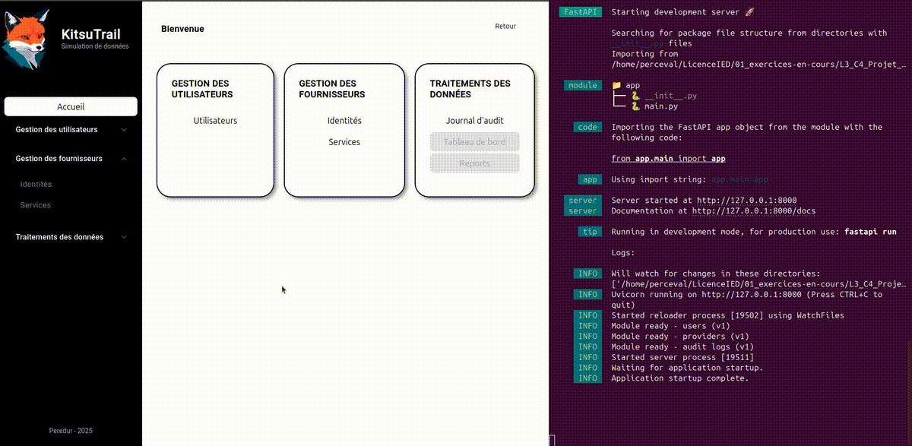

# Bilan d'étape 3 : features

>**Rappel**: Cette étape visait à finaliser l'application pour être prête à accueillir le traitement des données.
> L'application reste une simulation d'une plateforme de gestion d'identité est d'accès.

Ici les modifications ont concernées les 3 entités (Backend, Frontend & Base de données).
A l'issue de cette étape on une simulation suffisamment aboutie pour permettre la création de tableau de bord.

Les éléments suivants ont été mis en place:
- Ajout de fournisseurs d'identité (idp) et de service (sp) dans la base de données
- Accès aux fournisseurs en passant par l'API
- Visualisation des fournisseurs dans des pages dédiées.
- Ajout de log d'audit basé sur les utilisateurs et les fournisseurs dans la base de données
- Accès au log d'audit en passant pas l'API
- Visualisation des log d'audit dans un tableau dédié
- Sélection des colonnes à afficher dynamiquement
- Interface de sélection des filtres (champ et plage temporelle), construction de la requête SQL

## Fournisseurs
Les fournisseurs dans le cadre de L'IAM sont des plateforme ou des applications qui ont pour rôle soit d'asserter l'identité d'un utilisateur (IDP) soit de lui fournir un service (SP).
Généralement un SP va recevoir une demande d'accès par un utilisateur. Cette demande sera déléguée à un IDP qui va authentifier l'utilisateur avant de donner son verdict à au SP.


Pour KitsuTrail, les deux types de fournisseurs sont présents.
On simule la plateforme agissant comme un IDP avancé avec un répertoire interne et la possibilité d'appeler des IDP supplémentaires.
Ces IDP supplémentaires sont d'autant de méthode d'authentification possible pour l'utilisateur.

Les fournisseurs sont générés à l'initialisation de la base SQL.
Le schema de la table est la suivante:
| champ | type | infos |
|-------|------|-------|
| id | INTEGER | Primary key |
| type | STRING | sp, idp |
| protocol | STRING | Internal, OIDC, ... |
| name | STRING | |

Coté backend, j'ai seulement mis en place deux endpoints pour récupérer la liste des IDP et des SP
- /api/v1/providers/idp
- /api/v1/providers/sp

Le développement des SP est minimaliste car il est assez proche de ce qui est fait pour les utilisateurs.
Pour la simulation de l'activité, je n'ai pas la nécessité, a ce stade, d'avoir un système complet de gestion des fournisseurs.

La visualisation des fournisseurs suit les principes développés pour la visualisation des utilisateurs.
A ce stade, chaque fournisseur ne dispose pas des sa propre page, comme ce qui est fait pour les utilisateurs.

### Preview


## Journal d'audit
Pour pouvoir mesurer l'activité des utilisateurs sur une plateforme, il faut pouvoir simuler cette activité.
L'activité principale reste celle liée à la fourniture des autorisations. 
On peut ajouter une activité de management (CUD users & providers)

**Activité de management**

Cette journalisation conserve les actions réalisée par l'administrateur.
On retrouve les actions suivantes:
* create_user
* update_user
* delete_user
* create_provider
* update_provider
* delete_provider

Cet audit est assez classique sur un bon nombre de plateforme.

**Activité d'autorisation**

On se base donc sur l'user story suivante:
1. Un utilisateur tente d'accéder à une ressource (SP)
2. Le SP va demander l'autorisation à KT (Plateforme IAM) si l'utilisateur peut accéder au service
3. KT va demander à un fournisseur d'identité (IDP) si l'utilisateur peut s'authentifier
4. KT redirige l'utilisateur vers le moyen d'authentification de l'IDP
5. L'utilisateur s'authentifie sur la page de l'IDP
6. L'IDP donne le résultat à KT.
7. KT donne le résultat au SP
8. Le SP fournis la ressource à l'utilisateur


Ici, on log les actions qui sont directement liées à la plateforme IAM (KitsuTrail)
- 2 - access_request
- 3 - authentication_request
- 6 - authentication_reply
- 7 - access_reply

L'action peut réussir ou échouée avec les raison suivantes:
* *unknown_user*
    * access seul > info = user unknown dans KT
    * authentication (F) + access (F) > info = user unknown dans l'IDP
    * authentication (T) + access (F) > info = user unknown dans le SP

* *locked*
    * access seul > info = locked dans KT
    * authentication (F) + access (F) > info = user locked dans l'IDP
    * authentication (T) + access (F) > info = user locked dans le SP

* *timeout*
    * authentication (F) + access(F) > info = no user did not authenticate

* *permission_denied*
    * authentication (F) + access (F) > blocage IDP > info = IDP: detail dans info
        * *details*
            * role_missing
            * group_missing
            * attribut_mismatch
            * wrong_credentials
    * authentication (T) + access (F) > blocage SP > info = SP: detail dans info
        * *details*
            * role_missing
            * group_missing
            * attribut_mismatch


**Schéma de la table d'audit**
| nom               | type      | nullable | valeurs possibles          | description                      |
|-------------------|-----------|----------|----------------------------|----------------------------------|
| timestamp         | TIMESTAMP | required | 2025-05-04 15:35:10:000000 | date heure de l'évènement        |
| audit_id          | STRING    | required | (uuid.uuid4())[:8]         | identifiant de l'évènement       |
| user_id           | STRING    | nullable | e0e150a4                   | utilisateur concerné             |
| user_login        | STRING    | nullable | triss.merigold             | login de l'utilisateur           |
| provider_type     | STRING    | nullable | idp, sp                    | type de provider                 |
| provider_id       | INTEGER   | nullable | 1                          | identifiant du provider          |
| provider_name     | STRING    | nullable | Kitsu SSO                  | nom d'affichage du provider      |
| provider_protocol | STRING    | nullable | SAML, OIDC, ...            | protocol utilisé                 |
| trace_id          | STRING    | required | (uuid.uuid4())[:8]         | relation entre plusieurs actions |
| source_ip         | STRING    | nullable | 145.168.154.1              | source de la requête             |
| source_admin      | STRING    | nullable | system                     | admin à la source de l'event     |
| category          | STRING    | required | management, autorisation   | type d'évènement                 |
| action            | STRING    | required | (cf actions)               | évènement journalisé             |
| result            | STRING    | required | success, fail              | résultat de l'action             |
| reason            | STRING    | nullable | (cf raisons)               | raison d'un échec                |
| info              | STRING    | nullable | (cf info )                 | informations complémentaires     |

### Génération de l'activité

Voici les spécifications:
- Les premières actions commencent après la création de l'utilisateur ou du provider
- L'échec de l'authentification entraîne l'échec de l'accès, la reason et l'info ruissellent sur le logs d'accès
- Le trace_id lie une authentification avec plus demande d'accès (simulation de session)
- Si un access log est seul c'est que le blocage ou l'erreur est intervenue sur KT
- Même si une authentification est réussie, l'accès au SP peut échouer
- Pic de connexion à 8h et 13h
- Activité majoritaire entre 7h et 18 les jours de semaine
- Activité limitée le week end

Cas à générer:
1. auth OK - access_1 OK
2. auth OK - access_1 OK, access_2 NOK, ..., access_x OK (timeframe 5 minutes)
3. auth OK - access_1 NOK
5. access NOK
6. auth NOK - access_1 NOK

L'initialisation de la table d'audit se déroule en plusieurs temps:
1. Génération des logs de création des utilisateurs, avec la date created_at dans la table user
2. Génération des logs de création de providers
    Le premier provider est systématiquement créé à minuit la veille de la création du premier utilisateur.
    Cela permet d'éviter des incohérences avec un SP utilisé avant sa création.
    J'ai ajouté un delta de 30 minutes entre chaque nouvelle création. Techniquement aucun provider ne sera créé après le premier utilisateur
3. Génération des logs d'activité par utilisateur
    - L'activité de chaque utilisateur commencera 1 minute après sa création (created_at)
    - La fréquence d'activité devrait être plus forte en jours de semaine entre 6h et 10h et entre 13h et 15h. Une activité toutes les 1 à 5 minutes contre toutes les 1 à 3 heures hors de ces période. Cela devrait simuler une activité de travail journalière et hebdomadaire.
    - Il y a 3 chances sur 5 que l'authentification se passe bien.
4. Génération de logs de monitoring
    - Il arrive parfois que des clients souhaitent monitoring la présence du service d'authentification en utilisant des comptes inconnu à interval régulier. Il y a donc 3 user_inconnu de la plateforme que tentent une authentification toutes les 5 minutes

Dans tous les cas, la génération d'activité ne va pas plus loin que le moment où le processus a été lancé.

### Visualisation des audit logs.
#### Backend
Dans un premier temps, j'ai ajouté un endpoint API `api/v1/audit` qui permet de récupérer les entrées du journal avec un filtre avancé transmis dans le body
```json
{
  "filter": {
    "time_range": {
      "start": "2025-05-27T20:09:14.442Z",
      "end": "2025-05-27T20:09:14.442Z"
    },
    "trace_id": ["string"],
    "category": ["string"],
    "action": ["string"],
    "result": ["string"],
    "user_id": ["string"],
    "user_login": ["string"],
    "provider_id": [0],
    "provider_name": ["string"],
    "provider_type": ["string"],
    "provider_protocol": ["string"]
  },
  "per_page": 20,
  "page": 1
}
```
La time_range est convertie en `WHERE timestamp >= ${start} AND timestamp <= ${end}`.
Les autres filtres sont transformés pour utiliser la syntaxe `field IN (value1, value2)`. 
Cela permet d'effectuer des recherches plus flexible en mélangeant les conditions.

La gestion de la pagination est réalisée directement depuis le backend.
Cela rend plus facile, la mise en place de limitation si d'aventure l'API est ouverte

#### Frontend
L'affichage des audits logs à nécessité la mise en place de plusieurs composants Angular.

* audit-logbook: Composant principal hébergeant tous les autres
* audit-table: Récupération et affichage des données de l'API dans un tableau et gestion de la pagination
* audit-filter: Gestion des filtres pour les requêtes API hors plage date/heure
* time-range-filter: Gestion de la plage date/heure à afficher
* columns-filter: Contrôle l'affichage des colonnes en fonction des choix de l'utilisateur

Pour un soucis de cohérence j'ai continué d'utiliser la librairie *@angular/material*.
Cette librairie est présente dans les *dialog*, les *form*, la *table*, la *pagination* et les *date/time picker*.

Cette séparation a été mise en place dans l'objectif de pouvoir réutiliser facilement la table dans les pages des utilisateurs.
Il a fallu gérer la conservation de l'état des filtres après la fermeture des composants *audit-filter*, *time-range-filter* et *columns-filter*.
Cette conservation permet une expérience utilisateur plus intuitive.

Cette conservation des filtres est réalisée dans le composant *audit-logbook* qui possède 3 attributs:
- currentFilter: pour le filtre hors time_range
- currentTimeRange: pour la conservation de la time range
- currentColumns: pour la conservation de la liste des colonnes

Ces valeurs sont systématiquement transmises à composant grace à `mat-dialog` qui ouvre une boite de dialogue contenant le formulaire choisi.
Mon seul regret pour la librairie *@angular/material* est le manque de composant permettant de gérer la date/heure d'un coup.
En plus de cela, le composant *timepicker* ne prend pas en compte la gestion des secondes, ce qui peut être un peu limitant. 

### Preview
[../img/20250527_audit_log.gif](../img/20250527_audit_log.gif)
